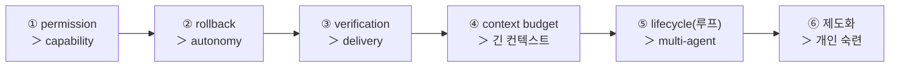

# 에이전트 하네스 엔지니어링 체크리스트

> **이 노트는?** 하네스 엔지니어링을 다룬 책 2권(book1·book2)과 Simon Willison·Neil Kakkar에서 뽑은 원칙을, 실무 자동화(웹 크롤링 · 공시/외부 데이터 수집 · 블로그 자동포스팅 · 데이터 처리(Excel/SQL) · AI API 호출)에 그대로 체크하며 적용할 수 있게 재구성한 실행 노트다. 핵심 사상 3줄: **System first, model second · error path = main path · verification independent.**
>
> 여기서 다루는 것은 **데이터/작업 자동화 엔지니어링**이며, 특정 도메인 판단(예: 회계 판단·투자 권유)을 대신하지 않는다.

## 0. 적용 우선순위 (book1 Appendix A — 빠뜨리면 "아직 안 터졌을 뿐")

---

## A. 권한·안전 (capability < permission) — 제1·4원칙
- [ ] 위험 작업은 **3치(allow / deny / ask)** 로 — *"할 수 있다(can)" ≠ "해도 된다(may)".* `ask`가 자동으로 `allow`로 올라가지 않게.
- [ ] **되돌릴 수 없는(irreversible) 작업 = deny 또는 ask 고정**: 블로그 실(實)발행 · DB `UPDATE`/`DELETE` · 파일 삭제 · 결제/유료 API.
- [ ] 위험 작업은 **테스트/스테이징 먼저**: 블로그는 **비공개·테스트 계정**에 먼저 → 확인 후 본계정. DB는 dev 스키마 먼저.
- [ ] **스코프 제한 자격증명 + 예산 한도**(Simon Willison): 외부 API 키는 rate·비용 상한 + 별도 테스트 키. *돈 쓰는 키엔 반드시 상한.*
- [ ] **무인 YOLO(전자동)면 샌드박스**: 크롤러/스크립트는 인터넷 제한 컨테이너·별도 계정·신뢰 호스트만. 비밀값 유출/프록시 악용 차단.
- [ ] **최고위험 채널(shell·rm·force push)은 별도 강규칙**(Bash급) — 한 줄에 여러 명령 묶어 우회 금지.

## B. 복구·재시도 (error path = main path) — 제6·7원칙
- [ ] **Circuit breaker**: 연속 실패 **N회(예: 3) 초과 시 중단**. *무한 재시도 금지*(무한 실패로 API/시간 낭비 방지).
- [ ] **계단식 복구(싼 것 먼저)**: 크롤 실패 → 재요청 → 대기/프록시 교체 → 그래도면 surface. 처음부터 최강수 X.
- [ ] **idempotent + resume**: "어디까지 했나" 상태 파일 기록 → 중단돼도 이어서(이미 쓰는 "이어서" 패턴을 표준화).
- [ ] **narrative log(anti-amnesia)**: 왜 멈췄고 무엇을 스킵했는지 남겨 다음 실행이 설명 가능하게.

## C. 상태·컨텍스트 (context = budget, govern first) — 제3·5원칙
- [ ] **상태 파일 = 척추**: 대화/메모리 밖 **디스크**에. "에이전트는 잊어도 repo는 안 잊는다."
- [ ] **메모리 인덱스 파일 = index, not diary**(예: ≤200줄/≤25KB): 본문은 topic 파일, 인덱스는 한 줄 포인터.
- [ ] **LLM 호출 전 컨텍스트 먼저 정리(govern first)**: 거대 입력 밀어넣고 모델이 정리하길 기대 X — 필요한 것만 슬라이스.
- [ ] 자를 때도 **핵심 선행 제약은 남긴다**(per-skill truncation > 통째 drop).

## D. 루프·정지조건 (query loop = heartbeat) — 제3원칙
- [ ] **정지조건 단일화 금지**: 성공 ≠ 실패 ≠ 부분완료 ≠ 사용자중단, 각각 다른 처리. (예: 크롤 결과 **0건**이 성공인지 실패인지 명시)
- [ ] **단조 진행 + ledger 마감**: 시작한 작업마다 결과(성공/실패/스킵) 한 건씩 — 미완 항목 추적 가능.
- [ ] **`/goal`·`/loop`엔 검증 가능한 정지조건**: "테스트 통과 & 0건 아님" 처럼. (별도 모델이 완료 판정)
- [ ] **interrupt 처리**: 중간에 끊겨도 부분 결과를 정리(synthetic result)하고 trace 일관성 유지.

## E. 검증 분리 (verification independent — maker ≠ checker) — 제8·9원칙
- [ ] **만든 주체 ≠ 검증 주체**: 생성 스크립트/에이전트가 자기 결과를 채점하지 않게 — 별도 검증 단계/에이전트.
- [ ] **블로그·콘텐츠**: 발행 전 게이트(키워드·금칙어·중복·깨진 링크·이미지 누락).
- [ ] **정밀 인용 도메인 산출물**(숫자가 맞아야 하는 분야): 산술 검증(예: 차변=대변 같은 합계 일치)·스키마 단언·행수(row count) 검증. *정밀 도메인의 진짜 무기.*
- [ ] **크롤링 결과**: 스키마·필수필드·이상치 검증 **후에만** DB 적재.

## F. 제도화 (institutions > tricks) — 제2·10원칙
- [ ] 반복 규칙을 **CLAUDE.md / AGENTS.md / 스킬**에 박기 — 매번 재설명 금지(intent debt 제거).
- [ ] **위험 tier로 승인 분류**(도구 이름 아님): `read | write | irreversible` → irreversible은 항상 deny|ask.
- [ ] **런타임 우선(CLAUDE.md) vs 구조 우선(AGENTS.md) 선택**(book2): 빠른 실험은 CLAUDE.md식, 팀·재현성은 AGENTS.md식 규칙 파일로.
- [ ] **워크트리 병렬 + 고유 포트 자동할당**(Neil Kakkar): 여러 자동화 동시 실행 시 포트/파일 충돌 방지.

---

## 자동화 유형별 우선 적용

| 자동화 | 가장 먼저 적용할 항목 |
|---|---|
| **웹 크롤링** | B(circuit breaker·resume) → E(스키마 검증 후 적재) → A(rate·스코프) |
| **공시/외부 데이터 수집** | A(API 예산·키 분리) → E(산술/스키마 검증) → B(resume) |
| **블로그 자동포스팅** | A(테스트계정·발행=irreversible→ask) → E(발행 전 게이트) → D(0건/실패 정지조건) |
| **데이터 처리(Excel/SQL)** | E(산술·스키마·행수 검증) → A(DB write=ask) → C(상태 파일) |
| **AI API 콘텐츠 생성** | A(비용 상한) → E(생성≠검증 분리) → C(context budget) |

## 시작 3단계 (가장 레버리지 높음)
1. 가장 위험한 자동화 1개에서 **irreversible 작업(발행·DELETE)을 ask/테스트계정으로 게이트**.
2. 그 스크립트에 **circuit breaker(연속실패 3회 중단) + 상태 파일(resume)** 추가.
3. **별도 검증 단계 1개**(maker≠checker) 붙이기 — 발행/적재 직전 게이트.

---

## 출처
- 📖 Harness Engineering for Claude Code (book1) — 10원칙·Appendix A 체크리스트·권한 3치·circuit breaker·context budget
- 📖 Harness Design: Claude Code vs Codex (book2) — CLAUDE.md vs AGENTS.md·tier 승인
- Simon Willison, "에이전트 루프 설계"(2025-09-30) — YOLO·샌드박스·스코프 자격증명·예산 한도
- Neil Kakkar, "Claude Code 생산성"(2026-03-16) — 워크트리 병렬·고유 포트
- 관련: Addy Osmani, "Loop Engineering"(2026)

*외부 자료에서 원칙을 추출·재구성한 실행 체크리스트.*
