> [!quote] 한 줄 요약
> **"Prompt determines how it speaks. Harness determines how it acts."** — 모델은 가장 말 잘하고 가장 불안정한 부품일 뿐이며, 신뢰성은 모델이 아니라 그것을 둘러싼 **harness**(control plane / query loop / tool·permission / context governance / recovery / multi-agent verification / team institution)에서 나온다. 모토: **"System first, model second" / "Order first, cleverness later."**

> [!note] 출처
> Harness Engineering — A Design Guide to Claude Code (agentway.dev / Harness Books). 저자 자체 발행 설계 분석서이며, 아래는 그 내용을 읽고 정리한 외부 자료 요약 노트다. 책은 저작권 경계상 원본 코드는 미수록하고 구조·원칙만 추출한다고 명시한다. 참조: [agentway.dev](https://agentway.dev), [harness-books.agentway.dev/book1-claude-code](https://harness-books.agentway.dev/book1-claude-code).

---

## 책 메타 정보

| 항목 | 내용 |
|---|---|
| 제목 | Harness Engineering — A Design Guide to Claude Code |
| 저자 | agentway.dev (@wquguru), Harness Books |
| 발행 | 2026-04-01 (rev fbf2b4), "Claude Code 소스 유출일 = 만우절" |
| 분량 | 108p / 본문 9장 + Appendix A(체크리스트)·B(다이어그램)·C(소스맵) |
| 성격 | 소스 한 줄씩 해설이 아니라, **왜 런타임이 이 형태로 자라야 했는가**를 다루는 설계 분석서 (저작권 경계상 원본 코드는 미수록, 구조·원칙만 추출) |
| 핵심 전제 | ① 무게중심은 모델 능력이 아니라 harness가 제약·실행을 조직하는 방식 ② 함수 나열이 아니라 "왜 이렇게 컸나" ③ 개인 트릭이 아니라 재사용 가능한 팀 제도 |

> [!warning] 팩트체크 / 주의
> 발행일·리비전·분량은 책 메타가 자체 표기한 값을 그대로 옮긴 것이고, "Claude Code 소스 유출"이라는 서술은 저자의 표현으로 독립 검증된 사실 주장이 아니다. 아래 파일명·라인 번호·상수값은 책이 인용한 내부 구조 표기이며, 특정 시점 코드 기준이라 실제 Claude Code 구현과 다를 수 있다. 즉 "공개된 런타임 설계 원칙의 한 해석"으로 읽는 것이 안전하다.

---

## 전체 구조 개요 (OVERVIEW)

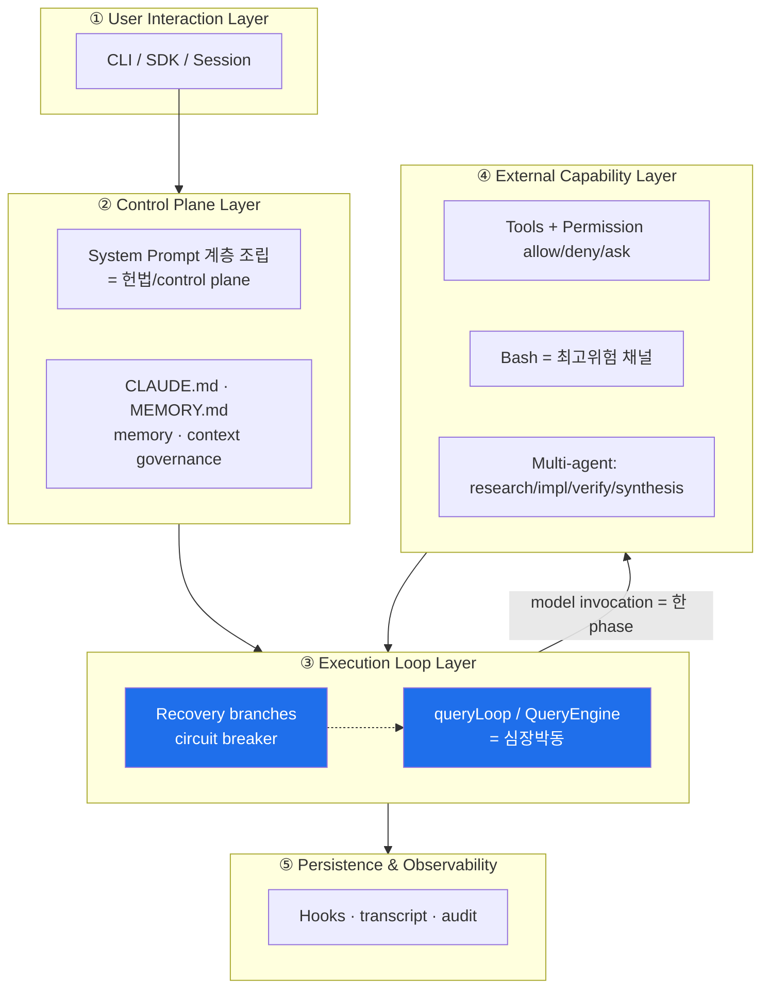

> 핵심: **모델은 최상단도 최하단도 아니다. query loop 안의 한 phase일 뿐**이고, 시스템을 붙잡아 두는 것은 control plane과 recovery plane이다.

### 6개 Pillar ↔ 9개 추출 원칙(장별) 매핑

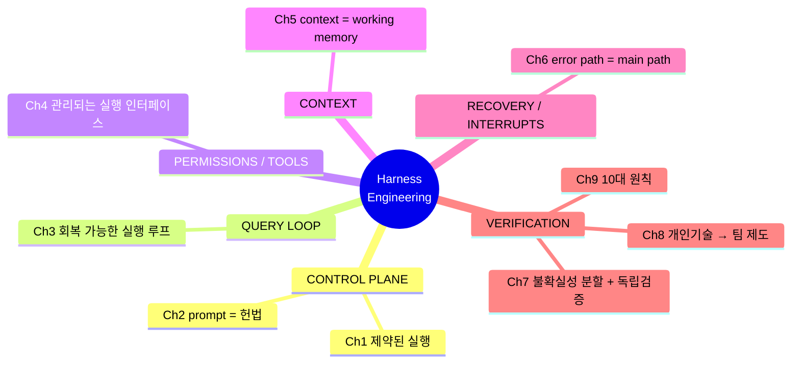

---

## Ch1. Why Harness Engineering Matters — 5개 harness layer

**핵심:** 확률분포(모델)가 shell·Git·network·파일에 닿는 순간 문제는 "답이 별로다"에서 "실행이 실제 피해를 냈다"로 바뀐다. harness란 **engineering 환경에서 모델 행동을 묶는, 계속 살아 있는 제어 구조**다. 무제약 능력은 blast radius만 키운다.

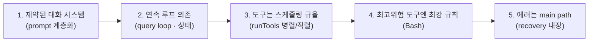

| Layer | 무엇을 인정하나 | 근거 모듈 |
|---|---|---|
| 1 | 모델 정확성은 지속되지 않음 | `constants/prompts.ts` |
| 2 | 지난 턴 미해결 이슈가 다음 턴으로 진입 | `query.ts` (cross-iteration state) |
| 3 | 도구는 모델 능력의 자연 연장이 아님 | `toolOrchestration.ts` |
| 4 | 강한 능력일수록 더 촘촘한 통제 | `BashTool/prompt.ts` |
| 5 | 실패는 예외가 아니라 구조적 상존 | `query.ts:453, :592` |

> **제1원칙:** *The key capability of an agent system is **constrained execution**.* 질서는 "smartness"가 아니라 **structure**로 지켜진다.

**Control plane 3대 불변식(invariants):**
- `prompt.layers ⊇ {default, project, custom, agent, append}`
- 모든 tool call `t`: 실행 전 scheduler가 동시성을 결정
- recoverable_error: route ∈ {recover, terminate_clean}

---

## Ch2. Prompt Is Not Personality, Prompt Is the Control Plane

**핵심:** persona는 "어떻게 보이나"에 답하지만, control plane은 **"무엇을 할 수 있고, 언제, 실패 시 무슨 일이 나며, fallback은 누구 책임인가"**에 답한다. Claude Code의 system prompt는 하나의 문자열이 아니라 **행동 블록의 계층 조립** = 캐릭터 전기가 아니라 runtime protocol.

### prompt 조립 precedence 체인 (`buildEffectiveSystemPrompt`)

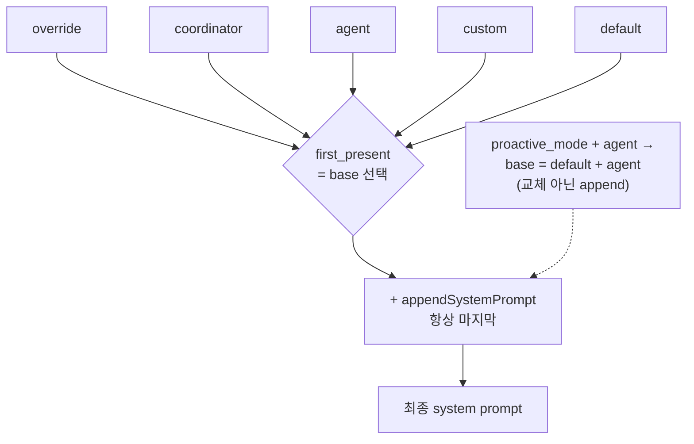

| 불변식 | 의미 |
|---|---|
| `precedence(override) > precedence(default)` | 순서는 하드코딩, "마지막에 쓴 사람이 이긴다" 금지 |
| `appendSystemPrompt never replaces base` | append는 오직 append만 |
| proactive 시 agent는 default를 **확장**(헌법은 직무기술서로 폐기 불가) | layer, not replace |

**prompt = memory와도 연결:** `getClaudeMds()`는 project/local/team/auto memory를 출처 라벨과 함께 병합하고, `buildMemoryLines()`는 **"미래 지식을 어떻게 적립할지"**까지 prompt로 규정(MEMORY.md는 index, frontmatter 형식, 저장 금지 정보 등). 즉 prompt가 knowledge-governance protocol이 된다.

**cache도 control plane:** `systemPromptSections.ts`는 cacheable / `DANGEROUS_uncachedSystemPromptSection`을 분리. static↔dynamic 경계를 명시해 cache를 태우지 않게 함. "어느 부분이 cache를 무효화하나"를 묻는 순간, prompt는 copywriting이 아니라 control plane.

> **제2원칙:** *Prompt is valuable only when it is **integrated into explicit control structure**.* prompt의 결정적 특징은 표현 완성도가 아니라 **enforceability(집행력)**.

---

## Ch3. Query Loop — The Heartbeat of an Agent System

**핵심:** 시스템 성숙도를 판단하려면 먼저 "loop가 있는가"를 묻는다. `query()`(src/query.ts:219)는 껍데기, `queryLoop()`(:241)가 핵심. **lifecycle**이 키워드 — 에이전트 자격은 "말투"가 아니라 "여러 턴 뒤에도 자기가 뭘 하는지 아는가"로 결정.

### Query Loop 메인 사이클

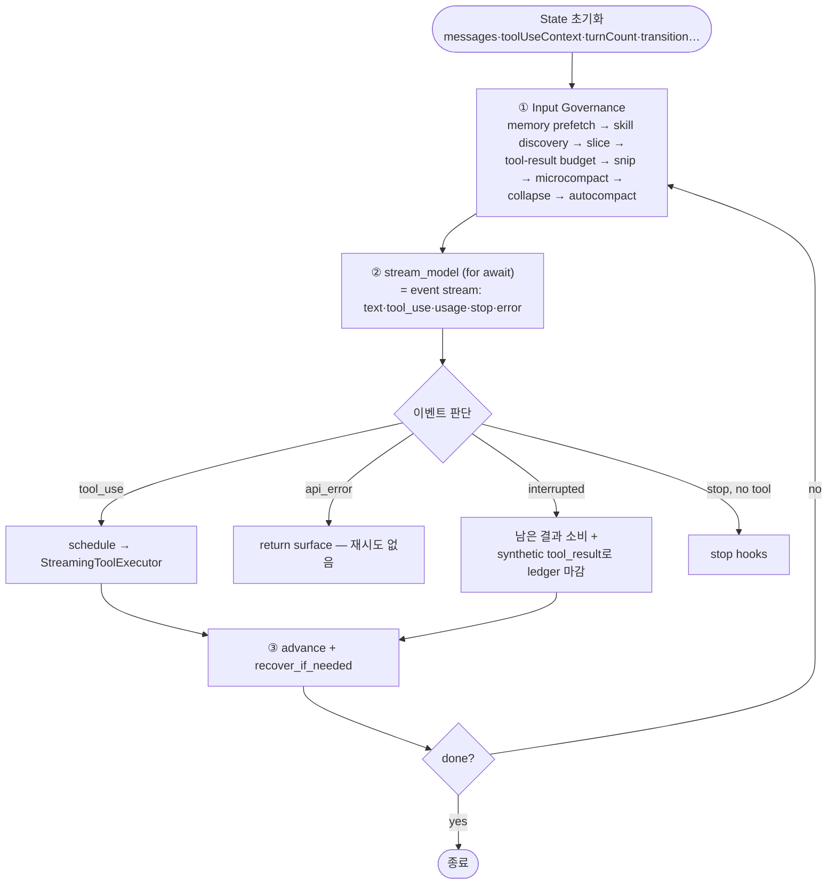

**State 객체(:268):** messages, toolUseContext, autoCompactTracking, maxOutputTokensRecoveryCount, hasAttemptedReactiveCompact, pendingToolUseSummary, stopHookActive, turnCount, transition.

**불변식:**
- `turnCount`는 monotonic
- emitted `tool_use`마다 대응 `tool_result` 존재 (ledger closed)
- `hasAttemptedReactiveCompact ⇒ no further compact` (self-loop 금지)

**중요 통찰:** runtime이 **모델 호출 전에 먼저 context를 정리**(govern first)한다. 많은 시스템은 반대로 거대 context를 밀어넣고 모델이 정리하길 기대 → runtime 책임을 확률분포에 떠넘김. Claude Code는 "현장 먼저 청소, 그 다음 실행."

### Stop 조건은 단일일 수 없다 (failure matrix)

| 사건 | 사전 상태 | 트리거 | 다음 |
|---|---|---|---|
| stream done + tool_use | pending tool 존재 | stop reason | 후속 실행 |
| stream done, no tool | pending 없음 | stop reason | stop hooks 진입 |
| user interrupt | any | abort | 남은 결과 drain + synthetic tool_result |
| prompt_too_long | compact 미시도 | recoverable error | collapse drain / reactive compact |
| max_output_tokens (cap<MAX) | — | stop reason | maxOutputTokensOverride↑, 재실행 |
| max_output_tokens (cap=MAX) | — | stop reason | meta user msg append, 계속 작성 |
| stop hook block + PTL 재발 | hasAttemptedReactiveCompact | double failure | stop hooks skip, 에러 surface |
| API error | — | api_error | 즉시 return, 재시도 없음 |

**QueryEngine:** *"owns the query lifecycle and session state for a conversation."* 하나의 QueryEngine = 하나의 대화, 각 `submitMessage()`가 상태를 보존한 채 새 턴을 연다.

> **제3원칙:** *The core capability of an agent system is maintaining a **recoverable execution loop**.* — cross-turn state, input governance, streaming, interrupt ledger, {completion/failure/recovery/continuation} 구분을 동시에 통치.

---

## Ch4. Tools, Permissions, and Interrupts — 세계를 직접 만질 수 없는 이유

**핵심:** 텍스트 오류는 이해 비용이지만 **잘못된 명령은 파일 삭제·프로세스 종료·Git history 손상**. 능력 증가 = 결과 증가. 답은 도구를 **managed execution interface**로 만들고 모델이 직접 손대지 못하게 하는 것.

### 권한 체인 (`useCanUseTool`)

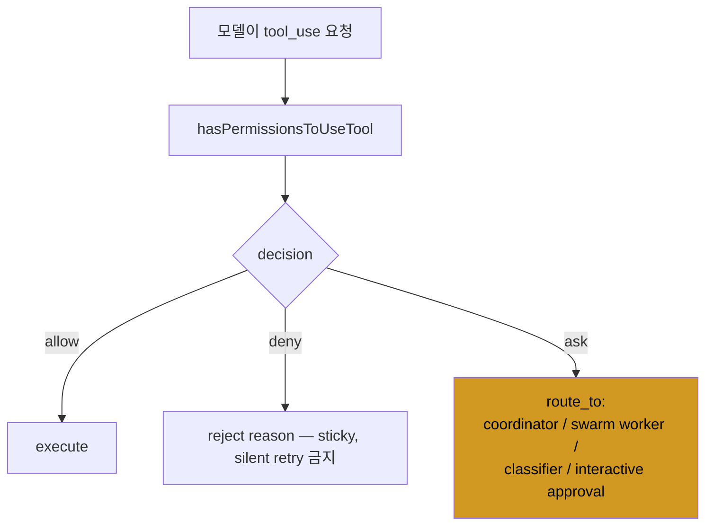

- **3치 논리(allow/deny/ask)** — boolean shortcut 없음. "intent 이해 ≠ 권한". **"can do"와 "may do"를 분리.**
- `ask`는 절대 자동으로 `allow`로 escalate 안 됨. PermissionResult는 bool이 아니라 **runtime semantics 객체**(왜 멈췄는지 표현).

### 도구 실행 라이프사이클 & 동시성

`runTools()`는 `partitionToolCalls()`로 `isConcurrencySafe()` 판정 → safe는 병렬 배치, unsafe는 직렬. 병렬 경로에서도 `contextModifier` 콜백을 버퍼링했다가 **원래 block 순서로 replay** → 실행은 병렬, 의미적 context 진화는 결정적. (동시성은 throughput을 올려도 causality를 깨면 안 됨.)

### 동시성 & interrupt failure matrix

| 사건 | 트리거 | 다음 |
|---|---|---|
| 병렬 배치 중 한 도구 실패 | sibling error | 나머지 유지 + contextModifier를 block 순서로 replay |
| user interject + interruptBehavior=cancel | user interrupt | cancel + "user interrupted" synthetic result |
| user interject + interruptBehavior=block | user interrupt | 도구 끝까지 마치고 새 메시지 차단 |
| streaming fallback | fallback | 배치 discard + fallback synthetic result(순서대로) |
| abort with pending tool_use | abort | synthesize tool_result, ledger 마감 |
| Bash compound 명령이 subcommand cap 초과 | classifier safety check | **deny** (ask로 라우팅조차 안 함) |

**StreamingToolExecutor**가 interrupt를 first-class semantics로 증명 — queued/executing/completed/yielded 상태 큐, sibling error·user interrupted·streaming fallback별 synthetic error, 도구별 `interruptBehavior`. **시작과 정지를 둘 다 설계**하는 것이 harness의 핵심 특질.

### Bash는 항상 가장 의심스럽다

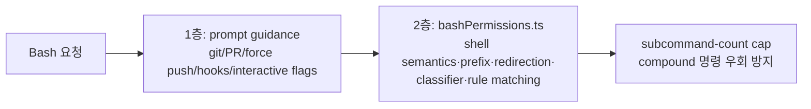

> **제4원칙:** *Tools are managed execution interfaces; **permission is an organ** of the agent system.* — model proposes, runtime authorizes; 병렬 하에서도 causal order 보존; interrupt는 first-class; Bash급은 명시적 예외; 도구 시스템은 사용자**와** runtime 자신을 함께 보호.

---

## Ch5. Context Governance — Memory, CLAUDE.md, Compact를 budget 체제로

**핵심:** "정보가 많을수록 똑똑하다"는 위험한 신화. context는 창고가 아니라 **비싸고, 인플레이션 잘 되고, 스스로 오염되는 budget.** 질문은 "더 기억하기"가 아니라 "기억을 통치하기".

### Context 소스 4계층 + compact

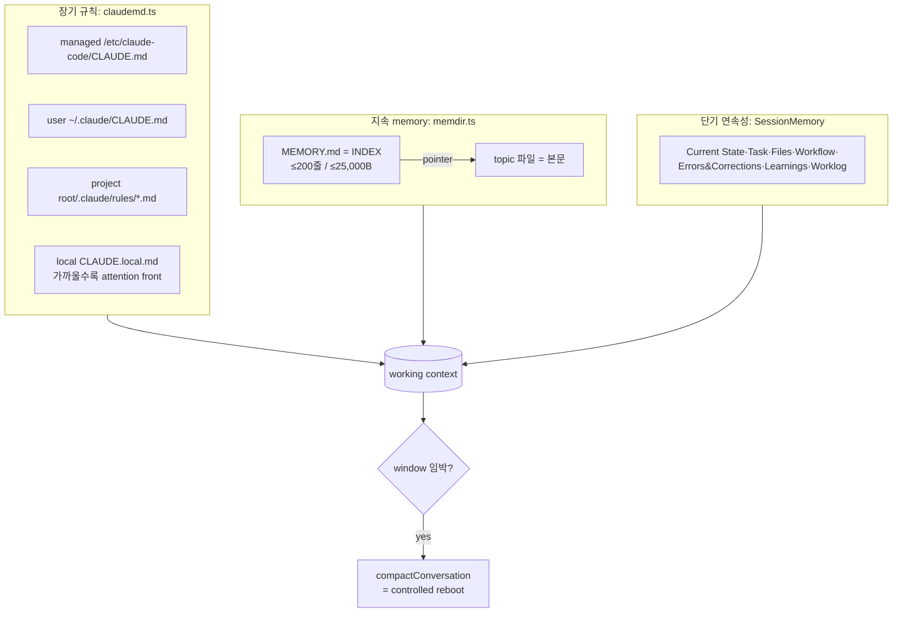

### Budget 임계값 (책의 표 그대로)

| 이름 | 값 | 용도 | 소스 |
|---|---|---|---|
| MAX_ENTRYPOINT_LINES | 200 | MEMORY.md index 줄 cap | memdir.ts |
| MAX_ENTRYPOINT_BYTES | 25,000 | index 바이트 cap | memdir.ts |
| MAX_SECTION_LENGTH | 2,000 | session memory 섹션당 cap | SessionMemory/prompts.ts |
| MAX_TOTAL_SESSION_MEMORY_TOKENS | 12,000 | session memory 총 budget | SessionMemory/prompts.ts |
| MAX_OUTPUT_TOKENS_FOR_SUMMARY | 20,000 | compact 요약 출력 예약 | autoCompact.ts |
| AUTOCOMPACT_BUFFER_TOKENS | 13,000 | autocompact 조기경보 buffer | autoCompact.ts |
| MAX_CONSECUTIVE_AUTOCOMPACT_FAILURES | 3 | circuit breaker 임계 | autoCompact.ts |

**MEMORY.md = index, not diary:** 본문은 전용 파일에, MEMORY.md엔 한 줄 포인터만. entrypoint가 비대해지면 index 무게가 context를 끌어내림 → 초과 시 `truncateEntrypointContent()` + 경고.

**compact = controlled reboot, not chat recap:** 요약 전 `stripImagesFromMessages`·`stripReinjectedAttachments`로 정리, 요약 후 readFileState 정리 → file/plan/skill/deferred-tool attachment 재주입, session/post-compact hook 실행, compact boundary 메시지 기록. 즉 **working semantics(행동 의미)를 재구축**. *per-skill truncation beats dropping* — 자를 때도 핵심 선행 제약을 남긴다.

> **제5원칙:** *Context is **working memory**. Governance exists to keep the system able to continue work.* — 정보량 최대화가 아니라 **action semantics 보존**이 우선.

---

## Ch6. Errors and Recovery — 실패 후에도 계속 일하는 시스템

**핵심:** 엔지니어링에서 가장 못 믿을 문장은 "under normal conditions". 성숙도는 매끄러울 때의 인간다움이 아니라 **실패가 system behavior처럼 보이는가**로 판단. error path는 main path이고 recovery는 사전 설계된 runtime 메커니즘.

### Recovery 결정 경로 (저강도 → 고강도 계단식)

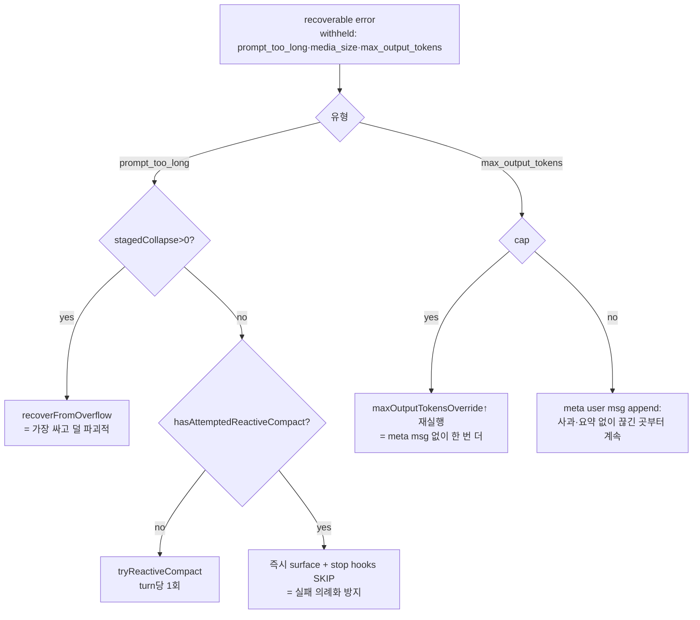

**circuit breaker:** `AutoCompactTrackingState`가 `consecutiveFailures` 추적, 3회 초과 시 compact가 due여도 skip. (과거 autocompact 무한 실패로 API 콜을 대량 낭비한 교훈 → "실패해도 좋지만, 기억 없이 무한 실패는 안 됨.")

**recovery의 recovery:** compact 요청 자체가 prompt_too_long을 맞으면 `truncateHeadForPTLRetry()`가 head의 오래된 API 라운드를 chunk로 잘라 재시도(lossy, last-resort escape hatch). "막혔을 때 1순위는 숨쉬기 회복, 그 다음이 고품질 history."

**circuit-breaker 불변식:**
- withheld_error ∈ {prompt_too_long, media_size, max_output_tokens}
- `hasAttemptedReactiveCompact ⇒ skip further reactive compact`
- `consecutiveFailures < MAX_CONSECUTIVE_AUTOCOMPACT_FAILURES`
- `compact aborted by user ⇏ summary_success` (abort ≠ 성공)
- 모든 withheld error는 recovery 소진 시에만 surface

**서사 일관성(narrative consistency):** `transition.reason`, `maxOutputTokensRecoveryCount`, compact boundary, synthetic error 메시지 = anti-amnesia 장치. recovery는 에러뿐 아니라 **시스템의 자기 설명 가능성**을 고친다.

> **제6원칙:** *An agent system shows reliability by maintaining **explainable, bounded, resumable** execution order after failure.*

---

## Ch7. Multi-Agent Work and Verification — 분업으로 불확실성 관리

**핵심:** 일정 규모를 넘으면 질문은 "한 에이전트가 할 수 있나"가 아니라 "어떻게 나눌까". 무제약 병렬은 단일 에이전트의 무질서를 복제할 뿐. 진짜 난제는 **에이전트별 불안정을 격리하면서 출력을 일관되게 재결합**하는 것.

### Coordinator-Worker 흐름 + 검증 분리

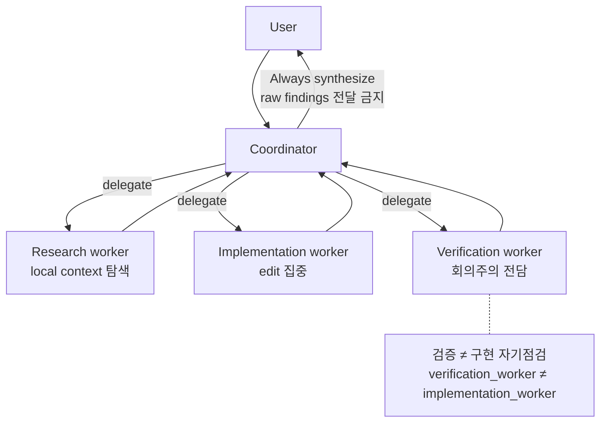

**fork의 제1원칙 = cache safety.** `CacheSafeParams` = {systemPrompt, userContext, systemContext, toolUseContext, forkContextMessages}는 부모와 일치해야 prompt-cache 적중(maxOutputTokens 함부로 변경 금지 — thinking config가 cache key). fork는 "또 다른 채팅창"이 아니라 **runtime-controlled branching**.

**state isolation = 기본 윤리.** `createSubagentContext()`는 readFileState clone, child abortController, getAppState는 prompt 억제 래핑, setAppState는 no-op. 공유는 `shareSetAppState` 등 **명시적 opt-in**으로만. (트랜잭션 DB 설계에 가까움.)

**synthesis가 희소 능력:** coordinator는 worker 결과를 소화해 **구체적 후속 prompt(파일·위치·변경)로 변환**해야 함 — raw 전달 금지. "research는 분산 가능, understanding은 재수렴해야".

### Subagent lifecycle (OS급 관리)

| 사건 | 트리거 | 다음 |
|---|---|---|
| parent abort + child in-flight | parent abort | child.abort 전파, cleanup 대기 (orphan 금지) |
| child crash | exit ≠ 0 | output evict + stop hook (exit 2면 stderr 피드백해 계속) |
| child timeout | timeout | child abort + synthetic result |
| cache key drift | CacheSafeParams 변형 | fork 거부 / cache 재빌드 |
| undeclared share | opt-in 미설정 | setAppState는 no-op, 부모 무영향 |
| stale memory conflict | 기록이 현실과 불일치 | **현실 신뢰**, memory update/delete (verify first) |
| leaked cleanup | unregister 없이 종료 | 강제 unregister + evict |

`hooksConfigManager.ts`: SubagentStart/Stop. **검증은 코드뿐 아니라 memory/추천에도 적용**(`memoryTypes.ts`: 추천 전 현 상태 검증, 충돌 시 관찰된 현실을 신뢰).

> **제7원칙:** Multi-agent는 research/implementation/verification/synthesis를 **서로 다른 제약 컨테이너**에서 돌리고 coordinator가 산출물로 봉합. 병렬의 진짜 가치는 속도가 아니라 **불확실성 분할 = 더 또렷한 책임 경계**.

---

## Ch8. Team Adoption — 똑똑한 도구를 지속 가능한 제도로

**핵심:** 전문가의 성공은 자동으로 안전한 팀 재사용이 되지 않는다. 개인기술은 지속적 감독·배경지식·상황판단에 의존하기 때문. 팀의 진짜 과제는 **전문가 머릿속 질서를 평범한 기여자가 영웅적 노력 없이 반복할 수 있는 workflow로** 바꾸는 것.

### 현실적 rollout 순서

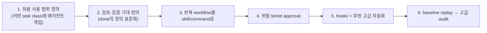

**주차별 빌더 체크리스트(요지):**
- Week1: 계층 CLAUDE.md(team/personal/project), 공유 검증(lint/type/test), forbidden zone을 repo 하드제약으로
- Week2: 결과(consequence)별 tiered approval(allow/deny/ask, Bash 별도), 첫 ≤3개 skill(전·후조건·검증 포함), "known issue로 done" 정책
- Week3: stop/post-tool-use hook, 월간 stale-memory 정비, baseline replay(Git/PR/CI) gap-free
- **Gate:** *전문가가 옆에 없어도 신참이 쓸 수 있으면 workflow가 성숙한 것.*

**핵심 분별:**

| 주제 | 좋은 형태 | 나쁜 형태 |
|---|---|---|
| CLAUDE.md | 안정·계층·저논쟁 = foundation | 백과사전화 = bulletin board (현행/구식 구분 불가) |
| 검증 | skill 수보다 **검증 정의**를 먼저 표준화 (quality는 검증만이 복제) | 가장 약한 기준에 시스템이 맞춰짐 |
| Skill | executable workflow module | 단순 긴 prompt / 과도한 제도화 |
| Approval | **위험·환경 민감도**로 tier (irreversibility 통제) | 도구 이름으로 분류 |
| Hooks | baseline 안정 후 timing-bound 액션 | 처음부터 도입(미관리 스크립트·디버깅 비용↑) |
| Replay | baseline(Git/PR/CI) 먼저 gap-free → 고급 audit | 처음부터 full audit = 비싼 전시 |

**Approval rule 템플릿(useCanUseTool 3치 미러):** `risk_tier: read|write|irreversible`, `decision: allow|deny|ask`, `ttl: session|turn|persistent` — *모든 irreversible 액션 ⇒ decision ∈ {deny, ask}*.

> **제8원칙:** Team adoption은 **acceptable boundaries · verification standards · recurring workflows**가 일찍 안정될 때 가장 잘 된다.

---

## Ch9. Ten Principles of Harness Engineering

> 책 전체를 압축: **Harness Engineering asks how systems can still behave like engineering systems when models themselves are not reliable.**

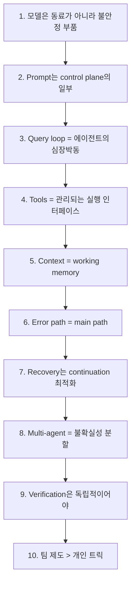

| # | 원칙 | 한 줄 |
|---|---|---|
| 1 | unstable components, not teammates | 모델은 동료급 안정성·책임을 자동 획득하지 못함 |
| 2 | prompt = control plane | persona 장식 취급하면 말만 잘하고 규율 없는 시스템 |
| 3 | query loop = heartbeat | loop 없으면 demo는 되어도 runtime은 아님 |
| 4 | managed execution interfaces | 위험할수록 일반 능력처럼 다루면 안 됨 |
| 5 | context = working memory | "more"가 아니라 "governable" 최적화 |
| 6 | error paths are main paths | recovery·circuit breaking은 설계 시점에 |
| 7 | recovery → continuation | 끊기면 요약보다 계속이 낫다 |
| 8 | partitions uncertainty | 병렬 가치는 속도가 아니라 책임 경계 |
| 9 | verification independent | 안 그러면 "done"이 "썼고 느낌 좋다"로 전락 |
| 10 | institutions > tricks | 개인기술의 제도화만이 조직 역량 |

> **마지막 문장:** *harness over excitement, institutions over cleverness, verification over confidence.* 이 셋을 내재화한 팀이 이미 Harness Engineering의 문 앞에 서 있다.

---

## Appendix 요약 (A 체크리스트 / B 다이어그램 / C 소스맵)

**A. Final short checklist (6가지):**
1. capability보다 **permission** 먼저
2. autonomy보다 **rollback** 먼저
3. delivery보다 **verification** 먼저
4. 긴 대화보다 **context budget** 먼저
5. multi-agent보다 **lifecycle** 먼저
6. 팀 숙련 기대보다 **institutions** 먼저
> 충족해도 우수성 보장은 아니지만, 빠뜨리면 보통 "아직 실패 안 했을 뿐".

**A.10 Implementation seeds:** `queryLoop` / `permission decision(allow·deny·ask)` / `forkAgent(CacheSafeParams)` / `recoverFromError(PTL→collapse→reactiveCompact→surface, MOT→cap↑→continue)` 의사코드 stub.

**B. 다이어그램:** 5계층 global control plane, query loop main+recovery, tool batch ordering & StreamingToolExecutor lifecycle, context sources & compact rebuild, coordinator-worker & verification separation, team governance map.

**C. 소스맵 (장↔파일):**

| 장 | 핵심 파일 |
|---|---|
| 1 | prompts.ts, systemPrompt.ts, query.ts, toolOrchestration.ts, BashTool/prompt.ts |
| 2 | + claudemd.ts, memdir.ts, systemPromptSections.ts, main.tsx |
| 3 | query.ts, QueryEngine.ts |
| 4 | toolOrchestration.ts, toolExecution.ts, StreamingToolExecutor.ts, useCanUseTool.tsx, PermissionResult.ts, bashPermissions.ts |
| 5 | claudemd.ts, memdir.ts, SessionMemory/prompts.ts, compact/autoCompact.ts, compact/compact.ts |
| 6 | query.ts, autoCompact.ts, compact.ts, api/withRetry.ts |
| 7 | forkedAgent.ts, coordinatorMode.ts, LocalAgentTask.tsx, hooksConfigManager.ts, skills/bundled/verify.ts, memoryTypes.ts |
| 8 | claudemd.ts, SkillTool/*, forkedAgent.ts, hooksConfigManager.ts, main.tsx |

---

## 실무 적용 메모 (일반화)

이 책은 "AI 코딩을 loop로 보라"는 실천/멘탈모델 관점(예: loop engineering 논의)을 **런타임 수준의 구조 설계**로 한 단계 내려서 보여준다: input governance → stream → tool schedule → recovery → stop. "loop를 왜/어떻게 돌릴까"와 "loop가 내부에서 어떻게 살아남나"가 합쳐져야 완성된다.

반복 작업을 자동화 루프로 돌릴 때 차용할 수 있는 4대 안전장치:
1. **stop 조건을 단일화하지 말 것** — completion ≠ failure ≠ recovery ≠ continuation.
2. **circuit breaker** — consecutiveFailures 카운트로 무한 재시도 금지(예: MAX 3).
3. **interrupt = ledger 마감** — synthetic 결과로 trace 일관성 유지.
4. **context budget 사전 예약** — compact 출력분을 미리 떼어두기.

지식 관리 관점에서 `MEMORY.md = index, not diary`(≤200줄/≤25KB, 본문은 topic 파일 포인터)는 인덱스/본문 분리 원칙의 좋은 근거 문헌이 된다.

정밀 인용이 필요한 도메인(예: 규정·표준 문서를 정확히 인용해야 하는 데이터 자동화 파이프라인)에서는 Appendix A 체크리스트(permission → rollback → verification → context budget → lifecycle → institutions)를 그대로 평가 프레임으로 쓸 수 있다. 특히 Ch7의 "구현 vs 검증 분리"(만든 사람이 검증하지 않는다)는 산출물 품질 게이트로 유용하다. 단, 이는 데이터·문서 자동화 관점의 적용 예시이며 회계판단이나 투자권유가 아니다.
