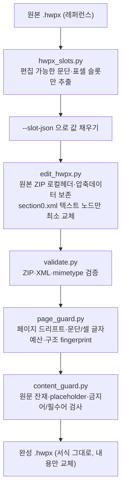

# hwpxskill — 한컴 HWPX를 서식 보존하며 편집하는 Agent Skill

> LLM 위키 계열이 아니라 **'문서 자동화'** 쪽 스킬이라 눈이 갔다. 한국에서 공문·보고서 하면 결국 한글(HWP/HWPX)인데, AI 코딩 에이전트한테 그걸 시키면 보통 서식이 다 깨진다. 이 스킬은 **OWPML 표준 XML을 직접 만져서 서식·표·셀병합을 그대로 둔 채 내용만 바꾼다.** 늘 그렇듯 1차 출처(GitHub API·repo 파일)로 확인했고, 하나 의외의 발견이 있었다 — **라이선스 파일이 없다.**

## 한 장 요약 — 서식 보존 편집 파이프라인

## 뭘 하는 물건인가

핵심 아이디어는 단순하다. HWPX를 통째로 새로 만들지 않고, **원본 ZIP 패키지·`header.xml`·표 크기·셀 병합·서식 참조는 손대지 않은 채 `Contents/section0.xml`의 텍스트 노드만 최소로 바꾼다.** 그래서 원본의 글꼴·색·여백이 거의 그대로 살아남는다. `charPr`/`paraPr` 단위로 서식을 제어한다.

작업은 두 갈래다.

- **원본이 없으면** 내장 템플릿으로 새로 만든다 — `base`·`gonmun`(공문)·`report`·`minutes`(회의록)·`proposal`.
- **원본이 있으면** 그게 핵심이다. 레퍼런스를 분석해 스타일·구조를 통째로 가져온 뒤 내용만 갈아끼운다. README도 "이게 핵심"이라고 적어놨다.

눈여겨본 건 **한컴의 '손상/변조' 경고를 피하려는 디테일**이다. 텍스트를 바꾼 문단에서는 `hp:linesegarray`(한컴이 저장해 둔 줄배치 캐시)를 제거하고, `hp:t` 안의 컨트롤 태그(`hp:fwSpace`·`hp:lineBreak`)와 순서는 반드시 보존한다. 문단을 통째로 다시 쓸 때는 `header.xml`의 `charPr`를 분석해서 **볼드·색상 강조가 새 문장에 묻어 들어가지 않도록**, 그 문단에서 가장 많이 쓰인 본문 글자높이에 가까운 비강조 스타일을 골라 넣는다. 이 정도면 "그냥 텍스트 치환"이 아니라 한컴 포맷의 함정을 꽤 파고든 셈이다.

검증 도구가 따로 붙어 있는 것도 좋다. `page_guard.py`는 페이지 수가 틀어졌는지·셀별 글자 예산을 넘겼는지를 잡고, `content_guard.py`는 원문 기관명·담당자·`○○` 같은 placeholder가 남았는지, 전면 재작성인데 원본 문장이 과하게 남았는지(`--max-unchanged-ratio`)를 검사한다.

| 스크립트 | 하는 일 |
|---|---|
| `build_hwpx.py` | 템플릿+XML 조합으로 HWPX 생성 |
| `edit_hwpx.py` | 양식 보존하며 텍스트/표셀만 수정(ZIP 재압축 아님) |
| `hwpx_slots.py` | 편집 가능한 슬롯 추출 → JSON으로 채움 |
| `analyze_template.py` | 레퍼런스 HWPX 분석 |
| `page_guard.py` / `content_guard.py` | 페이지·글자예산 / 금지어·잔재 검사 |
| `text_extract.py` · `validate.py` | 텍스트 추출 · 구조 검증 |

설치는 Agent Skills 표준이라 디렉토리만 넣으면 된다 — `~/.claude/skills/`, `.cursor/skills/`, `.agents/skills/`. 요구사항은 Python 3.6+와 `lxml`뿐이다.

## ⚠️ 팩트체크 (1차 출처: GitHub API·repo 파일)

- **별점 ★258 · 포크 77**(2026-06-25 실측). HWPX라는 한국 한정 니치 치고 꽤 높다. README엔 부풀린 수치 주장이 없어서 이번엔 정정할 게 없었다 — 깨끗.
- **🚩 LICENSE 파일이 없다.** repo 루트에 `.gitignore`·`README`·`SKILL.md`·소스 폴더만 있고 라이선스 파일이 없다(GitHub API에도 license 필드 없음). 이게 왜 중요하냐면, **명시적 라이선스가 없으면 법적으로는 저작자 전권(all rights reserved)** 이다. README가 `git clone`·`cp -r`로 복사해 쓰라고 안내하지만, **재배포·상업적 사용·2차 배포가 공식적으로 허용된 상태는 아니다.** 업무에 끌어다 쓸 생각이면 저자에게 라이선스를 확인하는 게 안전하다.
- **2026-02-22 생성, 최근까지 활발히 갱신**. 버전 태그/릴리스는 아직 없다.
- **AI로 만든 스킬**이다. 초기 커밋들이 Claude(Opus 4.6) 공동작성으로 찍혀 있고, README는 다른 기여자가 PR로 붙였다. "AI로 만든 한컴 자동화 도구"라는 점 자체가 요즘 흐름을 보여준다.
- 한 가지 경계 — 스크립트가 *실제로 손상 없이 편집되는지*는 코드를 돌려봐야 안다. 이 글은 repo가 그렇게 **주장·구현했다**는 사실까지만 확인한 것이다.

## 왜 챙겨봤나

HWP/HWPX는 한국 공공·기업 문서의 사실상 표준이다. 공문·보고서·회의록을 AI 에이전트로 서식 보존한 채 생성·편집할 수 있다면, 데이터·자동화 쪽 일에 바로 닿는다. 다만 실무에 붙일 때는 두 가지를 같이 본다 — **회사 실데이터·고객정보는 절대 넣지 않고**(공개 표준 양식 + 더미로), 위에서 짚은 **라이선스 미명시 리스크**를 확인하는 것.

---

> 같이 보면 좋은 글: [[ponytail-lazy-senior-dev-skill|Ponytail — '게으른 시니어' 코드 최소화 스킬]] · [[agent-skills-addy-osmani|Agent Skills (Addy Osmani)]] · [[ai-agent-coding-document-ai-6-sources-deep-dive|AI 에이전트 시대 개발·데이터 워크플로 6선]]

*GitHub 1차 출처(API·repo 파일) 팩트체크. 핵심 발견: 라이선스 파일 부재. 정리: 2026-06-25.*
