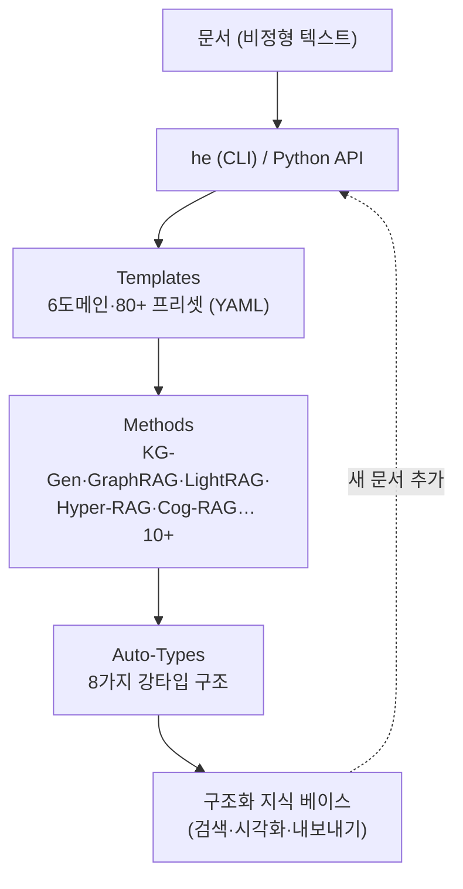

# Hyper-Extract — 텍스트를 '강타입 지식'으로

> **출처 메모** — 9bow(박정환)가 공유한 글([pytorchkr 경유](https://github.com/yifanfeng97/Hyper-Extract?utm_source=pytorchkr&ref=pytorchkr))을 읽고 정리한 노트다. 도구는 yifanfeng97의 오픈소스(Apache-2.0). 아직 직접 돌려보진 않았고, 아래 비교·기능은 저자가 README에서 주장하는 값이다.

나는 [[plaintext-md-llm-knowledge-vault|평문 Markdown 지식 볼트]]를 직접 운영하면서 "LLM이 문서를 읽어 지식으로 정리"하는 방식을 써왔다. 좋지만 한계가 명확하다 — **자유 형식 출력은 다시 정형화하기 까다롭고, 매번 결과가 달라진다.** Hyper-Extract는 바로 그 간극을 노린다. 비정형 텍스트를 **지속 가능·예측 가능·강타입(strongly-typed)**인 *지식 추상(Knowledge Abstract)*으로 바꾼다. 슬로건이 직설적이다 — *"Stop reading. Start understanding."*

## 한 장 요약 — 3계층 + `he` CLI



핵심은 LLM의 **구조화 출력 능력(json_schema 또는 함수 호출)**에 의존해, 자유 텍스트가 아니라 **정해진 스키마**에 맞는 결과를 강제한다는 점이다. 그리고 새 문서를 언제든 추가해 기존 베이스를 키우는 **증분 진화(incremental evolution)**를 지원한다.

## 8가지 Auto-Types — 데이터 성격에 맞게 고른다

| 계열 | 타입 | 용도 |
|---|---|---|
| **레코드** | AutoModel | 정형 보고서(필드 정해진 Pydantic 모델) |
| | AutoList | 핵심 포인트·항목 모음 |
| | AutoSet | 중복 제거된 엔티티 집합 |
| **그래프** | AutoGraph | 엔티티-관계 네트워크(지식그래프) |
| | **AutoHypergraph** | 여러 엔티티가 한꺼번에 맺는 관계를 **하나의 엣지**로 |
| | AutoTemporalGraph | 시간 흐름 |
| | AutoSpatialGraph | 위치 |
| | AutoSpatioTemporalGraph | 시간 + 위치 |

일반 그래프가 두 노드 사이 관계만 표현하는 데 비해, **하이퍼그래프**는 다중 엔티티 관계를 한 단위로 다룬다 — 이게 이 도구의 이름값이자 차별점이다.

## 경쟁 도구와의 비교 (저자 주장)

| 기능 | GraphRAG | LightRAG | KG-Gen | Hyper-Extract |
|---|---|---|---|---|
| 지식 그래프 | ✅ | ✅ | ✅ | ✅ |
| 시간 그래프 | ✅ | ❌ | ❌ | ✅ |
| **공간 그래프** | ❌ | ❌ | ❌ | ✅ |
| **하이퍼그래프** | ❌ | ❌ | ❌ | ✅ |
| **도메인 템플릿** | ❌ | ❌ | ❌ | ✅ |
| 대화형 CLI | ✅ | ❌ | ❌ | ✅ |
| 다국어 | ✅ | ❌ | ❌ | ✅ |

차별점은 지식그래프 공통 영역을 넘어 **공간 그래프·하이퍼그래프·도메인 템플릿(금융·법률·의료·한의학·산업·일반)**까지 커버한다는 것.

## 모델·시각화·MCP

- **검증된 모델 조합**: OpenAI(gpt-4o·gpt-4o-mini·gpt-5), Anthropic(claude-opus-4-8·claude-sonnet-4-6·claude-haiku-4-5), 바이롄(qwen-plus·qwen-turbo·deepseek-r1), vLLM 로컬(Qwen3.5-9B). ⚠️ **Anthropic은 임베딩 API가 없어**, Claude를 LLM으로 쓸 땐 OpenAI 호환 임베더(text-embedding-3-small·bge-m3 등)와 짝지어야 한다.
- **시각화**: `he show`로 인터랙티브하게.
- **MCP 노출**: `he-mcp`(읽기·내보내기 전용)로 Claude Desktop·IDE 에이전트에 지식 추상을 연결. `list_templates`·`info`·`search`·`ask`(RAG)·`export_obsidian` 제공.

## 설치 & 30초 사용

```bash
uv tool install hyperextract                       # Python 3.11+
he config init -k YOUR_OPENAI_API_KEY              # API 키
he parse examples/en/tesla.md -t general/biography_graph -o ./output/ -l en  # 추출
he search ./output/ "What are Tesla's major achievements?"                   # 질의
he show ./output/                                  # 시각화
he export obsidian ./output/ -o ./vault/           # Obsidian 볼트로
```

데이터 반출이 안 되는 환경이면 vLLM 로컬 모델(Qwen3.5-9B + bge-m3)로 **온프레미스** 운영 가능.

## 내 메모

- 가장 끌리는 건 **`export obsidian` — `[[위키링크]]`로 연결된 볼트로 내보내기**다. 내 평문 MD 볼트와 곧장 붙는 출구라서, "문서 → 강타입 그래프 → 내 볼트"의 파이프라인을 그려볼 수 있다. 기존에 본 [[llm-graph-builder-neo4j-knowledge-graph|Neo4j GraphRAG]], [[graphify-llm-wiki-ast-preprocessing|Graphify(AST 전처리)]]와 같은 '지식그래프 추출' 계열인데, 이쪽은 **하이퍼그래프·도메인 템플릿·CLI 일원화**가 색깔이다.
- 다만 비교표는 저자 주장이라 그대로 믿진 않는다. 실제로 한국어 문서에서 추출 품질·일관성이 어떤지, 토큰을 얼마나 먹는지는 직접 `he parse`로 돌려봐야 안다. (추후 실습 후 보강)
- 회사 실데이터·고객정보는 절대 넣지 않고, 공개 문서나 합성 데이터로만 테스트할 것.

---

*원문(저자: yifanfeng97, Apache-2.0) · 9bow(박정환) 공유 · [GitHub](https://github.com/yifanfeng97/Hyper-Extract).*
