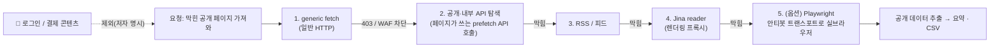

# Insane Search — 막힌 공개 페이지를 단계적으로 뚫는 플러그인

> 소개 영상 하나를 보고 repo 실물까지 열어 교차 확인했다. **Insane Search**는 봇탐지·WAF로 막히는 *공개* 페이지(X·Reddit·유튜브·네이버·쿠팡·알리 등)를 여러 합법 경로를 순차로 시도해 가져오는 플러그인이다. 마케터 입장에선 가격 비교·자막 추출에 솔깃한데, 한 가지는 분명히 해두고 싶었다 — **"공개 페이지면 무조건 합법"이라는 말은 만든 사람·소개 쪽 프레이밍이지, 법적으로 끝난 얘기가 아니다.** 정작 repo에는 책임을 사용자에게 넘기는 면책 문서가 붙어 있다.

## 한 장 요약 — 단계 상승(escalation) 사다리

## 뭘 하는 물건인가

원리는 영상에서 본 그대로다. 단순 크롤링은 보안(WAF·봇탐지)에 먼저 막히니까, **그 페이지가 내부적으로 쓰는 API 콜을 찾아 직접 부르거나**, RSS·렌더링 프록시(Jina)·실제 브라우저까지 단계를 올려가며 어떻게든 가져온다. README의 한 줄 설명이 정확히 이렇다 — *"generic fetch, public APIs, RSS, Jina, and optional Playwright로 막히거나 WAF가 센 페이지를 자동 우회하는 워크플로."* 영상에선 네이버 핫딜 수백 건 수집, 알리익스프레스 상품 100건을 CSV로 떨구는 걸 시연했다.

여기서 헷갈리기 쉬운 게 하나 있어 정리해 둔다. **마켓플레이스가 두 개다.**

- **Claude Code용**(원조) — 별 ★419. 영상이 실제로 데모한 건 이쪽이다.
- **Codex용**(포트) — 별 ★49, MIT 라이선스. 흔히 공유되는 링크가 이쪽이다.

둘 다 같은 제작자(GPTaku)의 플러그인 모음이고, Insane Search 말고도 PRD 인터뷰·병렬 빌드·딥리서치·Git 교사 같은 플러그인이 10개 넘게 들어 있다. 컨셉은 "AI Native, 벽 하나씩 허물기".

## ⚠️ 팩트체크

기술 동작은 README와 커밋으로 확인된다 — **사실이고, 꽤 강력하다.** 문제는 '합법성'을 어떻게 말하느냐다.

- **별점**: Claude Code판 ★419 / Codex판 ★49(2026-06-25 실측). 영상이 반복해서 "별 눌러달라"고 하는데, 별점은 개발자 인기투표일 뿐 금전 보상이 없다는 설명은 맞다. (영상 화자가 "광고 아니다"라고 한 부분은 화자 자기진술이라 따로 검증하지 않았다.)
- **면책 문서**: Codex repo는 MIT 라이선스에 더해 플러그인마다 **DISCLAIMER**(무보증·무제휴·**사용 책임은 사용자**)를 붙여놨다. 즉 **만든 사람 스스로 "책임은 쓰는 사람에게"라고 못박았다.** 영상의 "걱정 마세요, 절대 불법 아닙니다" 톤과는 결이 다르다.
- **🚩 '공개 = 합법'은 단정할 수 없다**(아래는 법률 자문이 아니라 쟁점 정리):
  - README 표현부터가 "**우회(auto-bypass)**"다. 공개 페이지라도 **약관·수집 규모·우회 수단**에 따라 위법 소지가 생긴다.
  - 국내에선 네이버·쿠팡 등 대부분이 약관에서 자동수집을 금지한다(민사). 거기에 **정보통신망법(보호조치 우회 접근)**, **저작권법상 데이터베이스제작자 권리**, 부정경쟁방지 같은 쟁점이 얽힌다. 경쟁사 DB를 크롤링했다가 위법으로 본 국내 판례(잡코리아–사람인 계열)도 있다.
  - 해외에서도 '공개 데이터 스크래핑'의 적법성 다툼(hiQ–LinkedIn 등)은 결론이 한 방향으로 정리돼 있지 않다.
  - **정리하면**: 도구의 기술은 진짜고 유용하지만, 합법이냐 아니냐는 *대상 사이트·목적·규모·우회 방식*에 달린 회색지대다. "공개면 무조건 합법"처럼 일률적으로 말할 사안이 아니다.
- **사소한 불일치**: README의 플러그인 표는 11개인데 커밋(마켓플레이스 카탈로그)에는 14개가 등록돼 있다 — 문서가 카탈로그보다 덜 갱신됐다.

## 왜 챙겨봤나 (그리고 어떻게 쓸까)

네이버·쿠팡 가격/핫딜 수집, 유튜브 자막 추출 같은 건 마케팅·콘텐츠 작업에 바로 쓸모가 있다. 영상도 대놓고 "마케터 가격 경쟁력"을 겨냥했다. 하지만 바로 그 **경쟁사 가격 DB 대량 수집**이 위에서 짚은 법적 쟁점의 정중앙이다.

그래서 내 결론은 이렇다 — 기술적으로는 인상적이고, 개인적인 공개 데이터 탐색에는 충분히 써볼 만하다. 다만 **업무로, 반복적으로, 경쟁사 대상으로** 돌릴 거라면 대상 사이트의 약관과 수집 규모·목적을 먼저 점검하고, 가능하면 **공식 API나 라이선스가 명확한 데이터 경로**(예: 정식 오픈 API, 상용 데이터 공급)와 비교한 다음 결정하는 게 맞다. "되니까 다 해도 된다"와 "해도 되는가"는 다른 질문이다.

---

> 같이 보면 좋은 글: [[designing-agentic-loops-simon-willison|에이전트 루프 설계 (Simon Willison)]] · [[agent-skills-addy-osmani|Agent Skills (Addy Osmani)]] · [[geoflow-geo-content-engine|GEOFlow — GEO 콘텐츠 엔진]] · [[llm-ai-news-sources-catalog|LLM/AI 정보원 카탈로그]]

*소개 영상 + GitHub 1차 출처(API·README·커밋) 교차 팩트체크. 기술은 사실, '합법' 단정은 제작자 프레이밍. 법률 자문 아님. 정리: 2026-06-25.*
