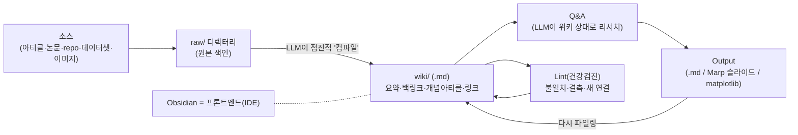

# Karpathy 원문 — "LLM Knowledge Bases"

> **이게 뭐냐** — 최근 회자되는 여러 llm-wiki 구현의 뿌리가 되는 원문 정리. Andrej Karpathy가 직접 쓴 글로, *"LLM으로 개인 지식베이스를 만들고 RAG를 우회한다"* 는 핵심 패턴을 담고 있다.

**핵심 한 줄** — "요즘 내 토큰 사용량의 상당 부분이 *코드 조작*이 아니라 **지식 조작**(마크다운+이미지로 저장)에 들어간다. 최신 LLM이 이걸 꽤 잘한다."

## 파이프라인 (원문 구조 그대로)

## 원문 항목별 정리

### 1. Data ingest (자료 수집)
- 원본 문서(아티클·논문·repo·데이터셋·이미지)를 **`raw/` 디렉터리에 색인**.
- LLM으로 **점진적으로 위키를 "컴파일"** → `.md` 파일들의 디렉터리 구조.
- 위키 = raw 전체의 **요약 + 백링크 + 개념별 분류 + 개념 아티클 작성 + 전부 링크**.
- 웹 아티클→.md 변환엔 **Obsidian Web Clipper**, 관련 이미지는 핫키로 로컬 다운로드(LLM이 참조하도록).

### 2. IDE — 프론트엔드 = Obsidian
- Obsidian으로 **raw 데이터 · 컴파일된 위키 · 파생 시각화**를 봄.
- ⭐ **LLM이 위키의 모든 데이터를 쓰고 유지** — 본인은 거의 직접 손대지 않음.
- 다른 렌더링 실험(예: **Marp**로 슬라이드).

### 3. Q&A
- 위키가 충분히 커지면 — 원문 예시 **~100 아티클 / ~400K 단어** — LLM 에이전트에 복잡한 질문을 던지면 알아서 리서치/답변.
- "**화려한 RAG가 필요할 줄 알았는데**, 이 정도(소규모) 스케일에선 LLM이 **인덱스·요약을 자동 유지**하고 관련 데이터를 꽤 잘 읽어온다."

### 4. Output
- 답을 텍스트/터미널이 아니라 **마크다운 파일 · Marp 슬라이드 · matplotlib 이미지**로 렌더 → Obsidian에서 다시 봄.
- 산출물을 **위키에 다시 "파일링"** → 탐색·질의가 항상 지식베이스에 **누적**됨.

### 5. Linting (건강검진)
- LLM "health check"로 **불일치 데이터 탐지 · 결측 보완(웹검색) · 흥미로운 연결(새 아티클 후보) 발굴** → 점진적 정합성 향상.
- LLM이 **더 파볼 추가 질문 제안**도 잘함.

### 6. Extra tools
- 데이터 처리 도구를 직접 개발 — 예: 위키 위에 **간단한 검색엔진**을 바이브 코딩(웹 UI로 직접 + **CLI로 LLM에 도구로 핸드오프**해 더 큰 질의 처리).

### 7. Further explorations
- repo가 커지면 자연스러운 다음 단계 = **합성데이터 생성 + 파인튜닝** → LLM이 컨텍스트가 아니라 **가중치에 데이터를 "알게"** 만들기.

### TLDR (원문 요약)
> N개 소스의 raw 데이터 수집 → LLM이 `.md` 위키로 컴파일 → 여러 CLI로 LLM이 Q&A·점진 향상 → 전부 Obsidian에서 열람. **위키는 거의 수동 편집 안 함 — LLM의 영역.** "여기 **스크립트 짜깁기 말고 엄청난 신제품**의 여지가 있다고 본다."

## 왜 중요한가 — 파생 생태계
이 한 글이 곧 이후 llm-wiki 구현들의 **"방법론(원형)"** 역할을 하며, 여러 도구가 여기서 파생됐다.

- **앱**: nashsu/llm_wiki
- **스킬**: 9bow/llm-wiki-skill
- **Claude Code 플러그인**: claude-obsidian
- **OKF+ICM 폴더네이티브**: obsidian-second-brain
- **표준화**: OKF(메모리)·ICM(워크플로)

Karpathy가 말한 *"엄청난 신제품의 여지"* 를, nashsu 앱·claude-obsidian 등이 정확히 그 빈칸을 메우는 중이다.

> 참고: 위 파생 프로젝트의 스타 수·릴리스 시점 등은 시점에 따라 빠르게 변하므로, 인용 시 각 repo의 현재 상태를 직접 확인하는 것이 정확하다.

---
*원문: Andrej Karpathy, "LLM Knowledge Bases" ([X 원문 트윗](https://x.com/karpathy/status/2039805659525644595), 2026) · [VentureBeat 보도](https://venturebeat.com/data/karpathy-shares-llm-knowledge-base-architecture-that-bypasses-rag-with-an). 정리: 2026-06-22.*
