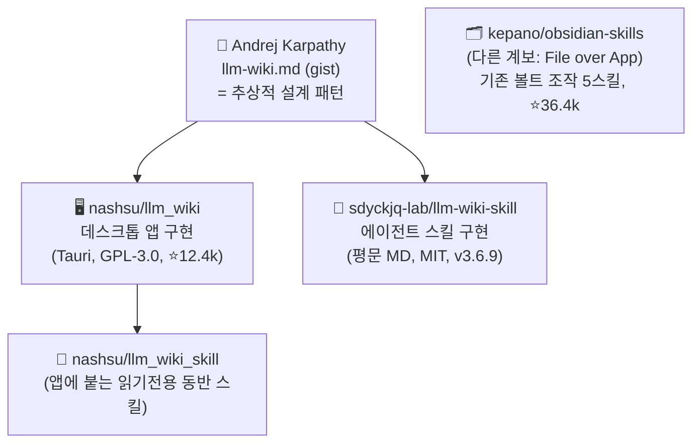
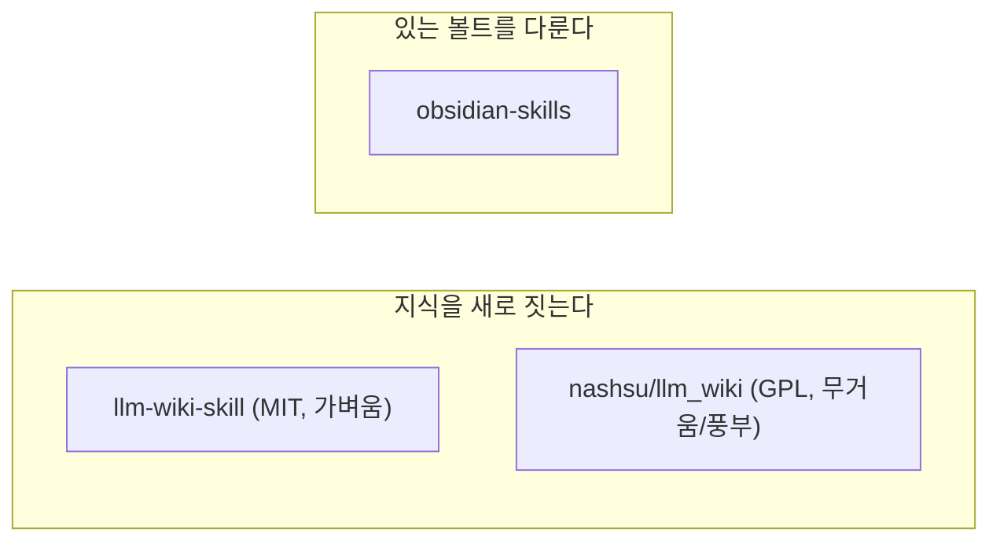

# 지식관리 도구 생태계 정리

> **핵심 결론** — llm-wiki 계열의 두 구현(nashsu/llm_wiki 앱, llm-wiki-skill)은 **같은 계보**다. 둘 다 **Andrej Karpathy의 `llm-wiki.md` 방법론**을 그대로 구현한 형제다. 차이는 *방법론*이 아니라 *형태(form factor)*: **무거운 데스크톱 앱(nashsu, GPL)** vs **가벼운 평문-MD 에이전트 스킬(MIT)**. `obsidian-skills`는 계보가 다르다(지식 *생성*이 아니라 기존 볼트 *조작*).

**출처**

- [nashsu/llm_wiki](https://github.com/nashsu/llm_wiki)
- [sdyckjq-lab/llm-wiki-skill](https://github.com/sdyckjq-lab/llm-wiki-skill)
- [kepano/obsidian-skills](https://github.com/kepano/obsidian-skills)
- [Karpathy — llm-wiki.md (gist)](https://gist.github.com/karpathy/442a6bf555914893e9891c11519de94f)

---

## 0. 한눈 계보도



> **Karpathy llm-wiki 패턴 한 줄**: "흩어진 자료를 **한 번 컴파일** → 위키로 만들고 → **지속 유지**. 매 질문마다 처음부터 만들지(RAG) 않는다." 3계층 = **원본(raw, 불변) → 위키(wiki, LLM 생성) → 스키마(schema, 규칙)**, 3작업 = **Ingest · Query · Lint**.

---

## 1. 도구 비교표

| | **llm-wiki-skill** | **nashsu/llm_wiki** | **obsidian-skills** (kepano) |
|---|---|---|---|
| 형태 | **에이전트 스킬** | **데스크톱 앱** | 에이전트 스킬 5종 |
| 실행 | Claude Code/Codex/OpenClaw/Hermes | Tauri v2 GUI 앱 | Claude Code/Codex |
| 저장 | 평문 MD | 평문 MD (+선택 LanceDB 벡터) | 사용자 기존 볼트 |
| 지식 생성 | **AI 자동 생성** | **AI 자동 생성** | ❌ 생성 안 함(편집/탐색) |
| 그래프 | 자체완결 HTML 그래프 | **sigma.js + Louvain 군집** | ❌ |
| 검색 | 전문+의미 | 토큰+벡터+그래프 4신호 | grep/CLI |
| 신뢰도 태그 | EXTRACTED/INFERRED/… | sources[] 추적 + 검토큐 | — |
| Karpathy 계보 | ✅ 직접 구현 | ✅ 직접 구현(명시 크레딧) | ❌ (File over App) |
| 라이선스 | **MIT** | **GPL-3.0** | **MIT** |
| 인기 | v3.6.9 | ⭐12.4k, v0.4.25 | ⭐36.4k |
| 설치 부담 | 낮음(스킬) | **높음(앱+Rust 빌드/바이너리)** | 낮음(플러그인) |

---

## 2. "llm-wiki-skill과 nashsu/llm_wiki는 같은 계보인가?" → **그렇다**

### 2.1 방법론은 동일
둘 다 README에서 **Karpathy `llm-wiki.md`를 명시적으로 크레딧**하고, 원본에서 다음을 그대로 계승한다:

- 3계층 **raw(원본·불변) → wiki(LLM 생성) → schema(규칙)**
- `index.md`(카탈로그) · `log.md`(작업 로그)
- 위키링크 상호참조 · 모든 페이지 **YAML frontmatter**
- **Obsidian 볼트로 그대로 열림**
- **LLM이 만들고, 사람이 큐레이션** 하는 역할 분담

### 2.2 폴더 구조도 거의 동일

```text
# nashsu/llm_wiki                    # llm-wiki-skill
my-wiki/                             <지식베이스>/
├── purpose.md   ← 둘 다 있음 →       ├── purpose.md
├── schema.md                        ├── .wiki-schema.md
├── raw/                             ├── raw/
│   ├── sources/                     │   ├── articles/ tweets/ pdfs/
│   └── assets/                      │   └── notes/ assets/ …
└── wiki/                            ├── index.md   log.md   (루트에)
    ├── index.md  log.md  overview.md└── wiki/
    ├── entities/                        ├── entities/
    ├── concepts/  ← (skill은 topics/)    ├── topics/
    ├── sources/                         ├── sources/
    ├── queries/                         ├── queries/
    ├── synthesis/                       ├── synthesis/(sessions/)
    └── comparisons/                     └── comparisons/
```

> 차이는 사소함: nashsu는 `index/log/overview`를 `wiki/` **안에** 두고 `concepts/`를 쓰며, 스킬은 루트에 두고 `topics/`를 쓴다. **본질 구조는 같다.**

### 2.3 진짜 차이 = 형태(form factor)

| | nashsu/llm_wiki | llm-wiki-skill |
|---|---|---|
| 무엇 | **완성형 데스크톱 앱**(3단 GUI·채팅·그래프·검토·Deep Research·크롬 클리퍼) | **순수 스킬**(에이전트가 셸/파일로 직접 실행) |
| 엔진 | 벡터(LanceDB)·Louvain 군집·4신호 관련도·웹검색(Tavily/SerpApi/SearXNG)·MCP 서버(127.0.0.1:19828) | 평문 MD 파이프라인 + 자체완결 그래프 HTML |
| 무게 | 무거움(Rust 빌드 or .msi 설치) | 가벼움(`npx skills add` / install.ps1) |
| 라이선스 | **GPL-3.0**(상업 통합 시 주의) | **MIT**(자유) |
| 외부 연동 | 자체 앱이 중심, **자체 동반 스킬**(`nashsu/llm_wiki_skill`)로 Claude Code가 **읽기전용** 질의 | 에이전트가 곧 실행 주체 |

> ⚠️ **헷갈리기 쉬운 3가지 repo 구분**
> 1. `nashsu/llm_wiki` = **앱**(생성·그래프·벡터)
> 2. `nashsu/llm_wiki_skill` = 그 앱에 붙는 **읽기전용 동반 스킬**(앱이 떠 있어야 함)
> 3. `sdyckjq-lab/llm-wiki-skill` = 앱 없이 **단독으로 위키를 생성**하는 평문-MD 스킬

---

## 3. Obsidian Skills (kepano) — 별도 계보 + 팩트체크

### 3.1 실제 내용 (repo 확인)
Obsidian CEO **Steph Ango(kepano)**, **MIT, ⭐36.4k, 46 commits**. **스킬 5개**:

| 스킬 | 하는 일 |
|---|---|
| **obsidian-markdown** | 옵시디언 MD 생성·편집(위키링크·임베드·콜아웃·properties) |
| **obsidian-bases** | `.base`(뷰·필터·수식·요약) 편집 |
| **json-canvas** | `.canvas`(노드·엣지·그룹) 편집 |
| **obsidian-cli** | CLI로 볼트 조작 + 플러그인/테마 개발 |
| **defuddle** | 웹페이지 → 깨끗한 MD 추출 |

- 구조: `/.claude-plugin/` + `/skills/{5폴더, 각 SKILL.md}` — 매우 단순
- **볼트에 구조 강요 안 함** / **엔티티·그래프 자동 생성 안 함**(탐색·편집 중심)
- 옵시디언 앱 불필요. 설치: `/plugin marketplace add kepano/obsidian-skills` 또는 `npx skills add …`
- 철학: **File over App**

### 3.2 ⚠️ 블로그 글 vs 실제 repo (팩트체크)
한 커뮤니티 소개 글은 *"GPT 정리본이라 원문과 다를 수 있다"*고 밝혔는데, 실제로 **과장/추가된 기능**이 있다:

| 블로그 주장 | 실제 repo |
|---|---|
| **Memory.md** 영구 기억 | ❌ 없음 |
| 시공간 인지 데일리노트 전용 로직 | ❌ 전용 스킬 없음(markdown으로 *만들 수는* 있음) |
| 시맨틱 검색 + 종합(Synthesis) | ⚠️ 별도 스킬 아님(obsidian-cli + 에이전트 일반 능력) |

→ 실제 obsidian-skills = **"옵시디언 4종 포맷 + 웹추출을 정확히 다루게 하는 도구"**. "기억하는 데일리노트 비서"가 아니다.

---

## 4. 역할 정리



- **llm-wiki(생성)** 와 **obsidian-skills(조작)** 는 **경쟁이 아니라 보완**.
- 기존 평문 MD 볼트에 바로 얹기 안전한 건 **obsidian-skills**(구조 강요 없음, 충돌 적음).
- 논문·아티클·트윗 같은 **읽을거리 스트림을 그래프화**하려면 llm-wiki 계열로 **새 KB를 따로** 두는 편이 깔끔하다.

### 어떤 llm-wiki를 고를까?

| 선택 | 이럴 때 |
|---|---|
| **llm-wiki-skill (MIT, 평문 MD)** | 지금 에이전트 워크플로우에 가볍게 붙이고, 평문 MD·Git·Obsidian으로 끝내고 싶을 때. 가장 가벼운 1순위. |
| **nashsu/llm_wiki (GPL, 앱)** | 그래프 시각화·벡터검색·Deep Research·검토 UI 같은 **완성형 기능**이 필요하고, 별도 앱 설치를 감수할 때. |

> ⚖️ **라이선스 메모**: nashsu는 **GPL-3.0** — 개인 사용은 자유지만, 조직 내부 도구로 *수정·재배포*하면 GPL 의무가 따른다. 스킬(MIT)·obsidian-skills(MIT)는 그 부담이 없다.

---

## 정밀 인용 도메인 적용 메모

규제/표준 문서처럼 **출처와 인용 정확도가 중요한 도메인**에서는, 위 도구들의 **신뢰도 태그(EXTRACTED/INFERRED, sources[] 추적, 검토큐)** 기능이 유용하다. 다만 이는 **데이터 정리·자동화** 관점의 예시이며, 특정 분야의 전문 판단이나 권유를 대신하지 않는다.

---

*근거: 3개 GitHub repo(nashsu/llm_wiki v0.4.25 · llm-wiki-skill v3.6.9 · obsidian-skills) 직접 확인 + Karpathy gist 크레딧 대조 (2026-06-22 기준).*
