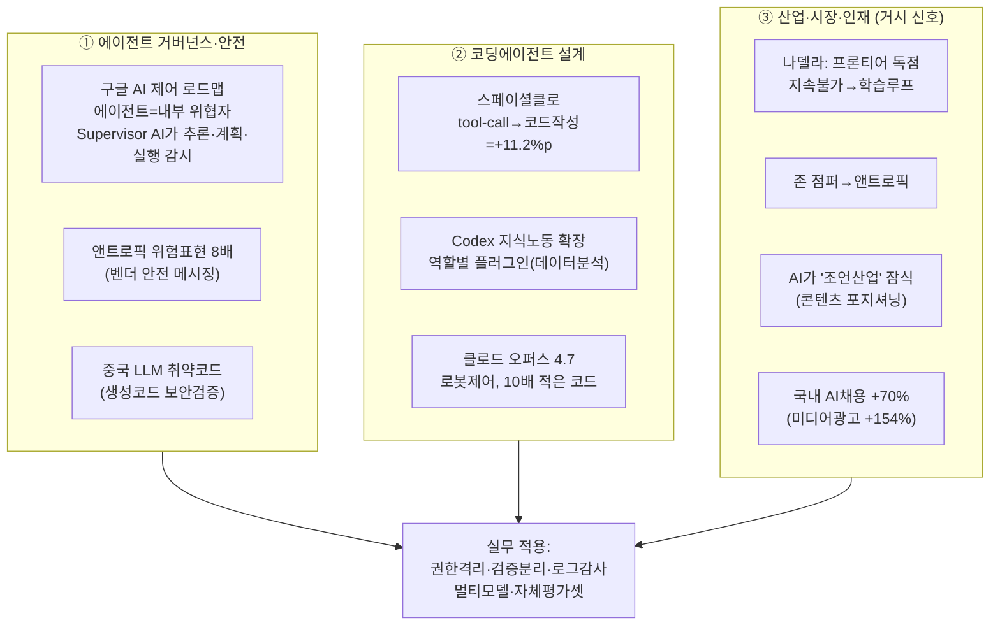

# 국내 AI 이슈 종합 — AI타임스 (2026-06-23)

> **한 줄 요약**: AI타임스(.com/.kr)에서 추린 LLM/에이전트 핵심 이슈 11건을 **본문 fetch 후 적대적 팩트체크**(과장 ⚠️ 분리). 헤드라인은 ① **구글 "AI 에이전트를 *내부 위협자*로 간주" 제어 로드맵**(거버넌스), ② **엔비디아 스페이셜클로 — "도구호출 대신 코드 작성"이 더 우수**(에이전트 설계), ③ **오픈AI Codex가 코딩 넘어 지식노동 도구로 국내 확산**. 이 세 가지가 코딩에이전트·자동화·하네스 관점에서 핵심.

---

## ① 에이전트 거버넌스·안전 — 오늘의 헤드라인

### ⭐ 구글, 'AI 제어 로드맵' — "에이전트를 *내부 위협자(Insider Threat)*로 간주하라"
[기사](https://www.aitimes.com/news/articleView.html?idxno=211970) · 구글 딥마인드, 2026-06-18(현지) 발표

- **핵심 발상**: AI 에이전트가 내부 시스템 접근권을 갖게 되니, **악의적 내부 직원을 가정하는 사이버보안 모델처럼** 에이전트를 *완전히 신뢰하지 않고* 잠재적 비정렬(misaligned) 존재로 본다 → **심층 방어(Defense-in-Depth)**.
- **구조**: 별도의 신뢰 가능한 **'감독자(Supervisor)' AI**가 작업 중 에이전트의 **추론 과정·행동 계획·실행 결과**를 지속 점검. 위험 분석은 **MITRE ATT&CK** 프레임워크 기반.
- **평가 3지표**: 커버리지(Coverage) · 재현율(Recall) · 응답 시간(Time-to-Response). 문서명 'Three Layers of Agent Security'.
- 배경 수치: 美 AI 에이전트 경제가치 2030년까지 **2.9조 달러(약 4,465조원)** 전망.
- ⚠️ **팩트체크**: 기사에 원문 보고서 1차 링크가 없어 인용 검증이 어렵고, 2.9조 달러 전망의 출처 기관이 불명확. (구글의 표현 자체는 충실히 옮긴 편)
- 🧭 **시사점**: 이는 하네스 설계의 **"권한·검증분리(maker≠checker)·로그감사"** 를 산업표준 언어로 정리한 것. "Supervisor AI"는 사실상 verifier 서브에이전트의 거버넌스판으로 볼 수 있다.

### 앤트로픽의 '공포 마케팅', 숫자로 — "오픈AI보다 위험 언급 8배"
[기사](https://www.aitimes.com/news/articleView.html?idxno=211965) · FT 분석 인용, AI타임스 2026-06-22

- FT가 앤트로픽·아모데이 CEO의 공식 성명·블로그·SNS를 분석: 앤트로픽 **1,000단어당 위험표현 약 5개** vs 오픈AI **0.6개** → 약 **8배**. (2026년 앤트로픽: '위험' 336회·'안전장치' 121회·'취약성' 128회 / 오픈AI: 30·33·10회)
- ⚠️ **팩트체크**: '공포 마케팅'은 **단어 빈도 → 마케팅 의도**로 비약한 프레이밍(상관≠인과). 위험 언급이 많다는 사실이 마케팅 동기를 입증하진 않음.
- 🧭 벤더(앤트로픽=Claude 제공사) 거버넌스 포지셔닝 톤 비교 자료. ①의 구글 로드맵과 묶어 "벤더가 말하는 안전 vs 실제 구현해야 할 통제"로 구분하면 유용.

---

## ② 코딩에이전트 설계 — "코드가 인터페이스"

### ⭐ 엔비디아 '스페이셜클로(SpatialClaw)' — 도구호출 대신 *코드 작성*이 더 우수
[기사](https://www.aitimes.com/news/articleView.html?idxno=211981) · 엔비디아(NVlabs), 재학습 불필요(training-free)

- VLM의 약점인 **공간 추론**을, 모델 재학습 없이 **에이전트 프레임워크**로 향상. 핵심은 도구 사용 방식을 **'구조화된 tool-call' → 'VLM이 파이썬 코드를 직접 작성·실행·확인·수정'** 으로 바꾼 것.
- 상태 유지 Jupyter 커널에서 한 셀씩 코드 작성 → SAM 3(분할)·Depth Anything 3(깊이)·NumPy·SciPy 조합 → `ReturnAnswer(...)`로 확정.
- **성능**: 20개 벤치 평균 **59.9%**, 기존 'SpaceTools' 대비 **+11.2%p**(DSI-Bench +17.6%p). 26B~397B 매개변수 6개 백본에서 일관 향상. 승리의 **52.2%가 "코드 조합"에서 기인**.
- ⚠️ 동일 도구셋·벤치 한정 전제는 제목에 안 드러남(과장은 적음).
- 🧭 **시사점**: Claude Code·Codex가 바로 "코드를 직접 쓰는 에이전트"다. "함수/MCP 도구호출보다 코드 작성형이 낫다"는 실증은 runtime-first 하네스 설계, "셸 > MCP" 주장과 한 방향. 크롤링·데이터 자동화도 "정형 도구"보다 "에이전트가 파이썬 짜서 조합"이 유연할 수 있다는 근거.

### ⭐ 오픈AI Codex, 코딩 넘어 '지식노동 인프라'로 국내 확산
[기사](https://www.aitimes.kr/news/articleView.html?idxno=40620) · AI타임스 2026-06-22

- 삼성전자 ChatGPT Enterprise+Codex 도입, 서울대 약 4.7만 명 ChatGPT Edu. 오픈AI 보고서 'The Next Era of Knowledge Work'.
- **Codex 주간 500만+ 사용자**, 데스크톱 앱 출시 후 주간 활성 **6배↑**. 신기능: **역할별 플러그인(데이터 분석·영업·크리에이티브·투자분석)**, 사이트(Sites), 주석(Annotations).
- ⚠️ "산업 전반 확산"은 삼성·서울대 2사례 일반화. 인용 수치(이메일 28%/검색 20%)는 출처 맥락 확인 필요.
- 🧭 **시사점**: Codex의 "데이터 분석 역할 플러그인" 확장은 분석·보고서 워크플로 자동화의 직접 후보가 될 수 있다.

### 앤트로픽 '프로젝트 페치' — 클로드 오퍼스 4.7, 로봇 제어 "인간보다 37배"
[기사](https://www.aitimes.com/news/articleView.html?idxno=211969) · 앤트로픽, 2026-06-18(현지)

- 사족보행 로봇견에 카메라·라이다 연결·물체인식·제어 과제. 클로드 오퍼스 4.7이 **AI 미사용 인간팀 대비 37배**, **클로드 사용 인간팀 대비 약 18.9배**, 인간이 1년 전 성공한 과제 기준 최소 10배 빠름(완료 12분 7초). **인간보다 약 10배 적은 코드**로 동등·우수.
- ⚠️ **팩트체크**: 제목 '37배'는 *AI 미사용 인간팀* 대비 특정 과제 수치 — 실제 클로드 사용팀 대비는 19배. 앤트로픽 스스로 **"폐쇄루프(공 가져오기) 정밀제어는 여전히 어렵다, 로봇공학 돌파구는 아니다"** 라고 선 그음. 이 맥락이 제목에서 빠짐.
- 🧭 "에이전트가 적은 코드로 실세계 제어 코드를 자동 생성·반복" = 자동화 설계 관점 참고(비판적 인용).

---

## ③ 보안 — 생성 코드 리스크

### "중국 AI, 미국 관련 작업서 취약 코드 생성" — 부즈앨런 보고서 논란
[기사](https://www.aitimes.com/news/articleView.html?idxno=211990) · 부즈앨런 해밀턴 'What's in America's Code?'

- 딥시크·큐원·미니맥스·키미에 **프롬프트에 미국 정부 맥락을 추가하면 취약코드 증가**: 큐원 **+130%**, 미니맥스 +20%, 딥시크 ~5%, 키미 차이 없음. 마틴 카사도: "스타트업 사용 모델의 ~80%가 중국 오픈소스일 가능성".
- ⚠️ **팩트체크**: 제목은 단정적 일반화지만, 본문상 **특정 프롬프트 조건의 증가 경향**이고 모델별 편차 큼(키미 무차이). 전문가들(킹스칼리지 올레이니크)이 "인위적·단일사례 일반화"라고 비판.
- 🧭 **시사점**: 오픈소스/중국계 LLM을 코드 생성에 쓸 때 **생성 코드 취약점 스캔을 워크플로에 삽입**(maker≠checker). "생성 → 검증" 파이프라인의 근거.

---

## ④ 산업·시장·인재 — 거시 신호

- **나델라 "소수 프론티어 기업의 가치 독점은 지속 불가"** [기사](https://www.aitimes.kr/news/articleView.html?idxno=40622) — X 에세이 'A frontier without an ecosystem is not stable'. 해법으로 **조직별 자체 데이터·평가 기반 '학습 루프'**, '인적 자본 + 토큰 자본' 결합. ⚠️ MS는 오픈AI 최대 투자자(130억\$+)이자 2026 capex ~1,900억\$ 주체 — **이해충돌 맥락이 약하게 다뤄짐**. 🧭 "단일 호스팅 API 의존을 줄이고 멀티모델·자체 평가셋"이라는 자동화 전략을 뒷받침하는 거시 신호.
- **노벨화학상 존 점퍼(알파폴드), 구글 딥마인드→앤트로픽 합류** [기사](https://www.aitimes.kr/news/articleView.html?idxno=40617) — 6/19(현지) X 발표, 9년 재직 후 이동. ⚠️ 앤트로픽 내 구체 직책 미공개. 🧭 Claude 제공사의 과학 AI 강화 신호.
- **AI가 '조언 산업' 잠식** [기사](https://www.aitimes.com/news/articleView.html?idxno=211972) — 팀 페리스 "내 책 판매 2022 대비 ~80%↓ 전망", 1Q26 자기계발서 -26.3%. 저자 데이터 학습 AI 코칭앱(월 수십~수백\$)으로 전환. ⚠️ 핵심 수치가 **팀 페리스 개인 블로그 1건**에 의존(GLP-1 등 다른 요인 무시). 🧭 **콘텐츠 포지셔닝 시사점**: "AI가 요약 가능한 처방형 정보" vs "대체 불가한 1차 데이터·고유 전문성" 구분이 콘텐츠 전략의 핵심.
- **국내 AI 인재 채용 전년比 +70%(역대최고)** [기사](https://www.aitimes.com/news/articleView.html?idxno=211991) — 잡코리아 1~5월 'AI' 공고 ~1.5만건, 신입 +80%. 업종별 **교육 +185%·미디어광고 +154%·문화예술디자인 +139%**, 직무는 콘텐츠제작·R&D·데이터분석. ⚠️ 단일 HR플랫폼 'AI 키워드' 집계(우대조건 포함, 실수요 과대 소지). 🧭 데이터분석·디지털마케팅 직무에서 'AI 활용 역량'이 채용요건화되는 흐름.

---

## ⑤ (저신뢰) 교차확인 필요
- **소프트뱅크, 아태 데이터센터 부지 확보** [기사](https://www.aitimes.kr/news/articleView.html?idxno=40616) — ⚠️ **본문에 위치·면적·금액·출처 전무**, 프랑스(750억€)·美 오하이오 등 기존 프로젝트를 배경으로 끼워 실체 이상으로 보이게 한 맥락누락형 기사. 인용 시 **'미확인' 태그 + 닛케이/소프트뱅크 IR 교차확인** 필수.

---

*수집 방법: AI타임스(.com/.kr) RSS에서 11건을 본문 fetch 후 적대적 팩트체크. 과장 보도는 ⚠️로 분리해 정정.*
