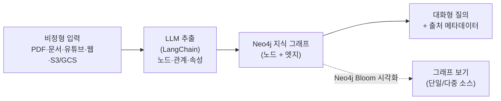
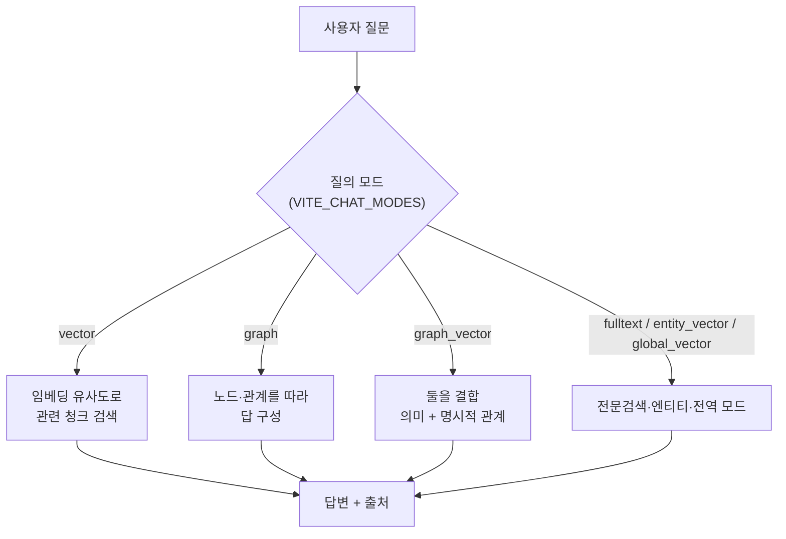
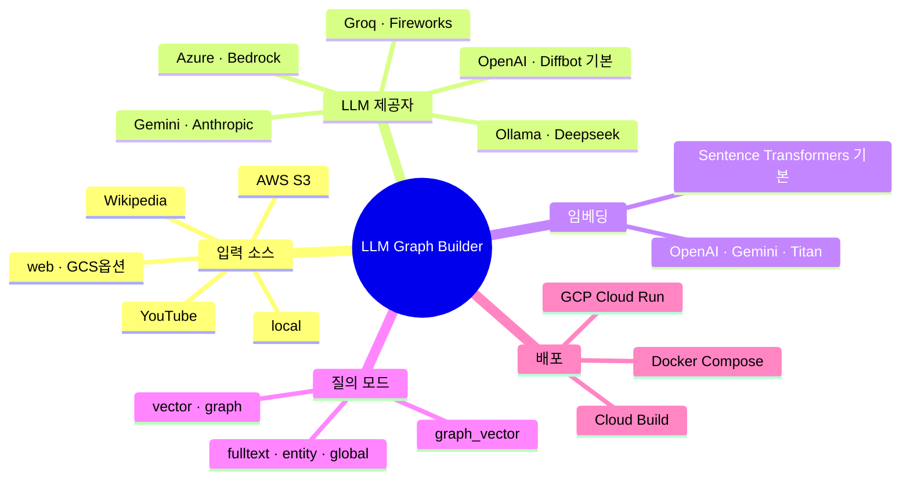

# LLM Graph Builder — 비정형 데이터 → Neo4j 지식 그래프

> **무엇** — PDF·문서·유튜브·웹처럼 구조 없는 데이터를 LLM으로 분석해 **Neo4j 지식 그래프**로 바꾸는 Neo4j Labs의 오픈소스 도구. LangChain으로 텍스트에서 노드·관계·속성을 추출하고, 만들어진 그래프에 **대화하듯 질의**한다. 단순 키워드·벡터 검색만으로는 따라가기 힘든 "문서 사이의 관계"를 그래프로 잇는 게 핵심. ⭐**4,887** · **Apache-2.0** · 백엔드 Python/FastAPI · 프런트 React.

## 전체 흐름 — 비정형 데이터가 질의 가능한 그래프가 되기까지



> **지식 그래프(Knowledge Graph)** 란? 정보를 "표의 행"이 아니라 **점(개체)과 선(관계)**으로 저장하는 방식이다. 예컨대 "회사 A —(인수)→ 회사 B" 처럼 개체 사이의 *연결*을 직접 담는다. 그래서 "A가 인수한 회사가 다시 투자한 곳은?" 같은 **관계를 따라가는 질문**에 강하다. 추출 단계에서 커스텀 스키마(어떤 노드·관계 라벨을 만들지)를 직접 정의해 통제할 수 있다.

## 질의는 어떻게 하나? — 벡터 vs 그래프 vs 하이브리드

이 도구의 채팅은 **데이터를 어떻게 검색할지**에 따라 모드가 갈린다. 핵심은 벡터 검색(의미 유사도)과 그래프 검색(명시적 관계)의 차이, 그리고 둘을 합치는 것.



> 벡터만 쓰면 "비슷한 문장"은 잘 찾지만 문서 사이를 잇는 관계는 놓친다. 그래프만 쓰면 관계는 정확하나 표현이 조금만 달라도 못 찾는다. **graph_vector(하이브리드)** 가 둘의 약점을 메워 더 풍부한 맥락을 끌어온다 — 이게 GraphRAG의 요지.

## 구성 요소 한눈에 (mindmap)



## 주요 기능

| 기능 | 내용 |
|---|---|
| 지식 그래프 생성 | LLM으로 비정형 데이터에서 노드·관계·속성 추출 |
| 스키마 지원 | 커스텀/기존 스키마로 그래프 생성 방식 제어 |
| 그래프 시각화 | Neo4j Bloom에서 단일·다중 소스 동시 확인 |
| 데이터와 대화 | 대화형 질의 + 출처 메타데이터, `/chat-only` 전용 인터페이스 |
| 토큰 추적 | `TRACK_USER_USAGE=true`로 사용자·DB별 토큰 사용량·한도 모니터링 |

## 설치 요건 (직접 실행 시)

- **Python 3.12+**, **APOC 설치된 Neo4j 5.23+**. (백엔드가 Cypher 변수 스코프 서브쿼리 `CALL (variable) { ... }`를 써서 5.20 등 이전 5.x에선 동작 안 함.)
- **Neo4j Aura 무료 등급**에서도 동작. 로컬 Docker Compose, Ollama 로컬 LLM, GCP Cloud Run 배포 모두 지원.

```bash
# 백엔드: example.env 복사 → Neo4j 접속정보 채우고 실행
cd backend
python3.12 -m venv venv && source venv/bin/activate  # Windows: venv\Scripts\activate
pip install -r requirements.txt
uvicorn score:app --reload
# 프런트엔드: yarn && yarn run dev
```

## ⚠️ 1차 출처 팩트체크 (GitHub API·README 직접 확인)

| 주장 | 검증 결과 |
|---|---|
| Apache 2.0 라이선스 | ✅ **사실** (`apache-2.0`, 개인·상업 자유 사용) |
| 백엔드 Python/FastAPI · 프런트 React · Neo4j 저장 | ✅ 사실 (README 배지·본문) |
| LLM 11종(OpenAI·Gemini·Diffbot·Azure·Anthropic·Fireworks·Groq·Bedrock·Ollama·Deepseek·OpenAI호환) | ✅ 사실 |
| Docker Compose 기본은 OpenAI·Diffbot만 활성 | ✅ 사실 |
| 질의 모드 7종(vector·graph·graph_vector·fulltext·graph_vector_fulltext·entity_vector·global_vector) | ✅ 사실 |
| Python 3.12+ / Neo4j 5.23+(APOC) | ✅ 사실 |
| ⚠️ 추가 주의 | **Diffbot API 키는 ENV 표상 Mandatory**(OpenAI 키는 Optional) — 기본 구성으로 돌리려면 Diffbot 키 필요. YouTube 처리엔 transcript 프록시 키 필요 |
| 스타 수 | (원문 미언급) 현재 **⭐4,887 · 포크 834** (2024-01 생성, 2026-06 갱신) |

## 시사점 — 내 작업과의 연결

평문 MD 지식 볼트를 운영하는 입장에서 흥미로운 건, **"벡터 검색만으로는 문서 사이 관계를 못 잇는다"** 는 전제다. 내 볼트도 `[[위키링크]]`로 노트를 잇는데, 그건 결국 사람이 손으로 만든 그래프다. LLM Graph Builder는 그 연결을 **LLM이 자동 추출**해준다는 차이. 다만 Neo4j라는 별도 DB·인프라가 필요하고 Diffbot 등 유료 키가 끼어, "평문 파일 + 위키링크"의 무인프라 장점과는 트레이드오프가 분명하다. GraphRAG를 본격적으로 볼 때 1차 레퍼런스로 둘 만하다.

---
*1차 출처: [neo4j-labs/llm-graph-builder](https://github.com/neo4j-labs/llm-graph-builder)(README·GitHub API) 직접 확인. 데모: llm-graph-builder.neo4jlabs.com. 원 소개글: PyTorch 한국 사용자 모임(9bow). 정리: 2026-06-24.*
