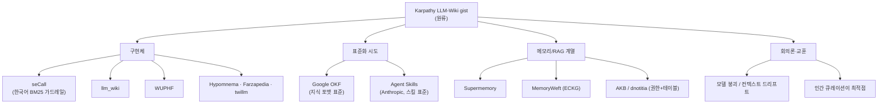
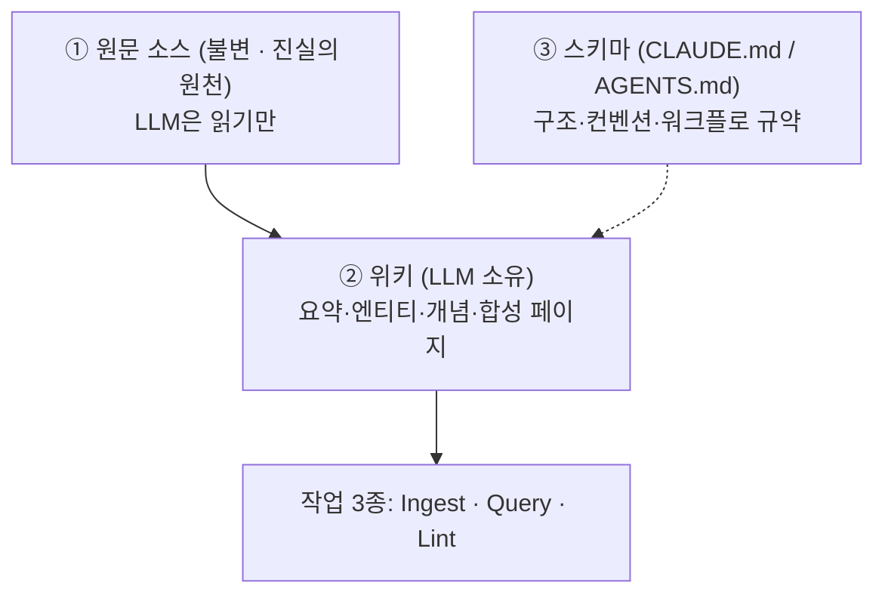
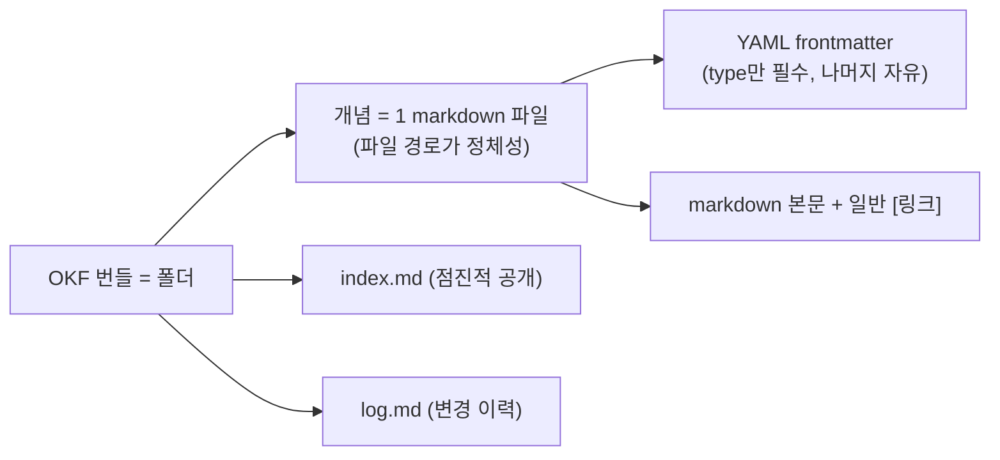
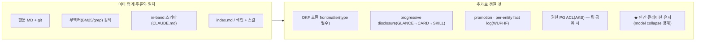

# LLM-위키 / 에이전트 지식베이스 생태계 정리

> 핵심: **Andrej Karpathy의 LLM-Wiki 패턴**이 촉발한 생태계 — seCall·OpenKB·llm_wiki 같은 구현체 계열 + 그 **원류** + **표준화 시도(Google OKF, Agent Skills)** + **회의론**.
> **한 줄 결론**: 평문 MD + 색인 + 무벡터 검색 + in-band 스키마 + 스킬이라는 조합은 **업계 주류 패턴과 일치**한다. 추가로 챙길 건 ① OKF 호환 frontmatter ② progressive disclosure ③ 회의론의 교훈(인간 큐레이션)이다.

---

## 0. 생태계 지도



---

## 1. 원류 — Karpathy LLM-Wiki (gist · 가장 중요)

LLM이 **직접 위키를 작성·유지**하는 패턴. 쿼리마다 원문을 재추출하는 RAG와 달리 **지식이 점진적으로 축적되는 영속 위키**다.



- **3-레이어**: 원문(불변) / 위키(LLM 소유) / 스키마(CLAUDE.md·AGENTS.md). "Obsidian=IDE, LLM=프로그래머, 위키=코드베이스".
- **작업**: Ingest(새 소스 → 10~15개 페이지 갱신) · Query(인용과 함께 합성, 좋은 답은 새 페이지로) · Lint(모순·낡은 주장·고아 페이지·누락 링크 점검).
- **인덱싱**: `index.md`(전 페이지 카탈로그 + 한 줄 요약, 쿼리 시 먼저 읽음) + `log.md`(시간순 기록, `grep "^## \["`로 파싱). **~100 소스·수백 페이지 규모는 임베딩 RAG 없이도 잘 작동**한다.
- **선택적 CLI**: `qmd`(마크다운용 로컬 BM25/벡터 하이브리드 검색 + 리랭킹, CLI + MCP). 소규모는 index 파일만으로 충분.
- **도구 팁**: Obsidian Web Clipper / 그래프 뷰 / Marp(슬라이드) / Dataview(frontmatter 쿼리) / git 버전관리.
- 사상적 뿌리: Vannevar Bush의 **Memex(1945)** — "누가 유지하는가" 문제를 LLM이 해결.

> 🔗 **연결**: 이 글 댓글에 **seCall 저자(hang-in/kurthong)가 직접 등장** — "저도 구현... [github.com/hang-in/seCall](https://github.com/hang-in/seCall)", "bm25가 한글 검색에 약해 **한국어 가드레일** 적용". 자주 분석되는 seCall의 출처가 바로 여기다.
> Karpathy의 4가지 장점(Farzapedia 사례): **명시성**(AI가 뭘 아는지 보임) · **데이터 소유**(로컬) · **파일 우선**(범용 포맷 + Unix 툴) · **BYOAI**(원하는 AI 연결).

---

## 2. 표준화 시도 (가장 새롭고 활용도 높음)

### 2.1 Google OKF — Open Knowledge Format

서로 다른 생산자의 위키를 **번역 없이 여러 에이전트가 소비**하게 하는 **벤더 중립 개방 포맷**. LLM-wiki 패턴을 이식·상호운용 가능한 형식으로 정형화한다.



- 설계 3원칙: **최소 규정**(필수 필드는 `type` 하나 — 어떤 type이 있는지·다른 필드·본문 구성은 생산자 자유) · **생산자/소비자 독립**(포맷이 계약, 양 끝단 도구는 독립 교체) · **플랫폼 아닌 포맷**(독점 계정·SDK·클라우드 불필요).

#### OKF 스펙 상세 (원문 2026-06-13, Google Cloud — Sam McVeety·Amir Hormati)

> "복잡한 압축·새 런타임·필수 SDK 없음. 그저—" **Just markdown**(어떤 에디터·GitHub·검색도구) · **Just files**(tarball·git repo·파일시스템) · **Just YAML frontmatter**(쿼리할 소수 필드만).

**frontmatter 필드(6개)** — 번들 = 개념(파일) 디렉터리, **파일 경로 = 개념의 정체성**:

| 필드 | 예시 |
|---|---|
| `type` (유일한 필수) | `BigQuery Table` |
| `title` | `Orders` |
| `description` | `One row per completed customer order.` |
| `resource` | 콘솔/원본 URL |
| `tags` | `[sales, revenue]` |
| `timestamp` | `2026-05-28T14:30:00Z` |

**디렉터리 + 개념 문서 예시:**

```
sales/
├── index.md            # 점진적 공개(progressive disclosure)
├── datasets/  (orders_db.md …)
├── tables/    (orders.md, customers.md …)
└── metrics/   (weekly_active_users.md …)
```
```markdown
---
type: BigQuery Table
title: Orders
tags: [sales, revenue]
---
# Schema
| Column        | Type   | Description                              |
| `order_id`    | STRING | Globally unique order identifier.        |
| `customer_id` | STRING | FK to [customers](/tables/customers.md). |
# Joins
Joined with [customers](/tables/customers.md) on `customer_id`.
```
→ 개념끼리 **일반 마크다운 링크**로 연결 = 파일시스템 부모/자식보다 풍부한 그래프. `log.md`(변경 이력)는 선택. **전체 v0.1 스펙은 한 페이지에 수록**된다.

- **레퍼런스 구현(PoC)**: ▶ **Enrichment agent**(BigQuery 순회 → 테이블/뷰마다 OKF 문서 초안 → 2차 LLM이 공식문서 크롤해 **인용·스키마·조인 경로** 보강) ▶ **정적 HTML 비주얼라이저**(단일 파일·백엔드 없음·데이터가 페이지 밖으로 안 나감) ▶ **샘플 번들 3종**(GA4 e-commerce / Stack Overflow / Bitcoin 공개데이터) ▶ Google Cloud **Knowledge Catalog가 OKF를 수집·서빙**.
- **활용도 시사**: 색인·frontmatter를 **OKF 호환(`type` 필수 + 6필드)**으로 맞추면 표준 도구·비주얼라이저와 상호운용된다. 도입 비용도 낮다. 정밀 인용 도메인 적용 예시로는 `type` 값을 문서 유형별로 두고(예: `type: 기준서`·`type: 질의회신`·`type: 사례`), `resource`에 원문 경로, `tags`에 분류 키를 넣는 식이다.

> 📎 **출처 메모**: OKF 발표 원문과 Obsidian "Create a vault" 도움말은 같은 메시지를 전한다 — *"로컬 마크다운 폴더"가 표준 그릇*이라는 것. **OKF = 상호운용 규약**, **Obsidian vault = 저장·열람 그릇**("노트를 저장하는 로컬 폴더", 빈 볼트 생성 또는 기존 폴더 열기). 저장(형식 레이어)과 색인·스킬(검색 레이어)을 분리하는 관점을 1차 출처가 재확인한다.

### 2.2 Agent Skills — Anthropic (agentskills.io)

스킬 = **지침 + 스크립트 + 리소스 폴더**(SKILL.md). Anthropic이 만들어 **오픈 스탠더드**로 공개했고, 다수 제품이 채택했다(Codex·Cursor·Gemini CLI·VS Code 등).

- **핵심 가치 = progressive disclosure(점진적 공개)**: 모든 지침을 한 문서에 몰면 토큰 낭비. 스킬은 **필요할 때만 세부 로드**한다. Claude는 description까지만 읽고 멈춰 토큰을 절약한다.
- HN 논쟁(활용도 직결):
  - **skills vs AGENTS.md**: Vercel 평가 56%에서 스킬 미호출 → AGENTS.md에 직접 명시가 더 안정적이란 보고. **활성 조건을 매우 명확히** 써야 한다(`/foo` 명시 호출 선호).
  - **Semantic Pyramid**(MOOLLM): `GLANCE.yml → CARD.yml → SKILL.md → README.md` 순 점진 세분화. GLANCE는 "관련 있나?"만 5~70줄로 판단. **INDEX.md가 INDEX.yml보다 80%+ 압축·서사 구조 우수**라는 주장.
  - "스킬 = 특정 주제의 README", "명확한 워크플로(X→Y→Z 검증)로 정의하면 잘 듣고, 모호한 가이드는 무시된다".
- **활용도 시사**: SKILL.md 기반 스킬은 **정확히 이 표준**이다. 트리거 description·역할 분담을 잘 잡은 위에 **GLANCE/CARD식 점진 공개**를 얹으면 토큰 효율이 올라간다.

---

## 3. 구현체들 (Karpathy 패턴 구현)

| 프로젝트 | 형식·검색 | 특징 | 라이선스 |
|---|---|---|---|
| **seCall** (hang-in) | Rust, BM25+벡터+RRF | 대화 로그 네이티브, 한국어 가드레일, 코덱스·제미나이 파서 | AGPL |
| **llm_wiki** (nashsu) | Tauri, LanceDB+그래프 | .msi, 4-신호 관련도, MCP | GPL |
| **WUPHF** (nex-crm) | **md+git, BM25+SQLite(벡터DB 없음)** | recall@20 **85%**, 에이전트별 notebook→**promotion**, per-entity fact log(append-only JSONL), `[[wikilinks]]`+일일 lint cron, `/lookup`+MCP | MIT |
| **AKB** (dnotitia) | OKF호환 vault+테이블+그래프 | 사람=웹UI·에이전트=MCP **같은 원본**, git diff, **권한(PG ACL)**, reef 이슈트래커 | OSS |
| **Farzapedia** | Claude Code + index.md | 일기·메시지 **2,500건 → 위키 400문서**, 백링크, RAG보다 파일탐색이 우수 | 사례 |
| **twillm / TiddlyWiki** | 단일 HTML / Node | **계산된 뷰가 materialized index 대체**(index.md는 stale 위험), frontmatter를 쿼리 가능 필드로 승격 | OSS |

> 💡 WUPHF의 **promotion(노트북→위키 승격)**, **per-entity fact log**, **lint cron**은 누적 자료를 *계속 쌓고 정리*하는 데 참고할 만한 패턴이다.
> 💡 twillm의 지적 — **"index.md는 세션이 지날수록 stale해진다"** → 세션 시작 시점에 색인을 자동 재생성하는 훅이 이 문제의 실용적 해법이 된다.

---

## 4. 메모리 / RAG 계열 (위키와 다른 접근)

| 프로젝트 | 접근 | 비고 |
|---|---|---|
| **Supermemory** | 대화에서 **fact 자동 추출** + 사용자 프로필 + Hybrid(Memory+RAG) | connectors(Drive/Gmail/Notion), multimodal 추출(PDF/OCR/비디오/코드 AST), MCP, 단일 바이너리, 벤치 1위, MIT |
| **MemoryWeft** (rawdev) | **Graph+RAG**, ECKG(관계 스키마 미리 안 정함, 쌓으며 발전) | AI 간 메모리 공유·검색, SQLite/PG, MCP |
| **mem0 / hmem 등** | 개인 메모리 누적 | 대체로 개인 단위 |

> **위키 vs 메모리**: 위키 = LLM이 **합성 페이지를 작성·유지**(백링크·모순검사 = 지식 합성). 메모리 = 대화에서 **fact를 자동 추출**해 적재(검색 중심). 권위 문서를 정밀 인용해야 하는 용도라면 **위키 계열**이 적합하다.

---

## 5. ★ 회의론과 교훈 (정밀 인용 도메인에 특히 중요)

HN/긱뉴스 댓글에서 반복된 경고 — **"구현 보류 + 검증 게이트 + 인용 규율 + 권위는 원문에"** 방향과 부합한다:

- **모델 붕괴(model collapse)**: LLM이 문서를 계속 재작성하면 정확한 정보가 **누적적으로 덜 간결·부정확**해진다(Nature 인용). "markdown 컬렉션을 **LLM이 전적으로 유지하면 품질 하락**, **사람이 유지하면 향상**."
- **컨텍스트 드리프트**: 위키를 매번 원문 대신 다시 읽으며 **2차 오류 누적**. "LLM은 CLAUDE.md 하나도 제대로 유지 못 한다"는 냉소도 있다.
- **결론 — 인간 큐레이션이 최적점**: "완전 자율 자기참조 시스템은 가치 없다. 진짜 가치는 인간이 '이건 이렇게 작동해야 한다'고 **개입할 수 있는 구조**다." debt/drift를 의식적으로 관리해야 한다.
- **무벡터 재확인**: "**RAG는 임베딩 필수 아님 — grep만으로 충분**." 정밀 인용 도메인엔 무벡터가 안전하다.
- **부기(bookkeeping)야말로 LLM의 강점**: 교차참조·일관성 유지처럼 사람이 포기하던 잡무를 LLM이 거의 0 비용으로 처리한다. (단, **판단·합성은 사람이 통제**)

> ✅ **정밀 인용 도메인 적용 원칙**: 원문(불변·권위)은 LLM이 손대지 않고, 합성은 **링크 허브로만**, 검증 게이트로 드리프트를 차단하고, 인용은 문단 reference로 고정한다. 위 교훈을 그대로 반영한 설계다. (이는 데이터 자동화 관점의 정리이며, 특정 도메인의 전문 판단이나 권유가 아니다.)

---

## 6. 종합 — 무엇이 주류이고 무엇을 더 챙길까



| 신호 | 출처 | 시사점 |
|---|---|---|
| 평문 MD + 무벡터 + 스키마 = 주류 | Karpathy·WUPHF·seCall | 현재 방향 검증됨 |
| 표준 포맷으로 상호운용 | **Google OKF** | frontmatter를 `type` 필수 OKF 호환으로 |
| 토큰 절약 | **Agent Skills / progressive disclosure** | 스킬에 GLANCE/CARD 층 추가 |
| 누적 자료 관리 | WUPHF promotion·fact log | 자료 누적·승격 흐름 설계 |
| 팀 공유·권한 | AKB(PG ACL) | 다인 협업 시 |
| **품질 방어** | 회의론(model collapse) | **인간 큐레이션·검증 게이트 유지** |

---

## 부록. 수록 글 색인

| # | 글 | 핵심 |
|---|---|---|
| 1 | Google OKF 공개 | 벤더중립 지식 포맷(md+frontmatter, type 필수) |
| 2 | Show GN: AKB (dnotitia) | OKF호환 vault + 테이블 + 권한(PG ACL) + MCP, reef |
| 3 | WUPHF (nex-crm) | md+git, BM25+SQLite, promotion, fact log, lint cron, MIT |
| 4 | Supermemory | AI 메모리 엔진, fact추출·프로필·hybrid·multimodal, MIT |
| 5 | Agent Skills (agentskills.io) | Anthropic 스킬 표준, progressive disclosure |
| 6 | OpenAI 에이전트 구축 실용 가이드 | 모델·도구·지침, 단일→다중, 가드레일, HITL |
| 7 | Show GN: flint (desktop.flint.so) | 비슷한 메모 추천 메모장(NLP·GNN) |
| 8 | Show GN: MemoryWeft (rawdev) | 그래프 AI 메모리 MCP, ECKG, 공유 |
| 9 | **Karpathy LLM-Wiki gist** | **원류** — 3레이어·Ingest/Query/Lint·index/log·qmd |
| — | 댓글: Farzapedia / **seCall(hang-in)** / model collapse 논쟁 / TiddlyWiki·twillm / Binder·AS Notes 등 | 사례·구현체·회의론 |

---
_본 문서는 외부 공개 자료(긱뉴스·HN·GitHub·gist)의 생태계 정리본이며, 읽기·판단용 자료다._
