# LLM 지식위키 — 3대 저장소 분석과 정밀 인용 도메인 적용

> 대상: seCall / OpenKB / llm_wiki 평가 + 정밀 문단 인용이 중요한 지식베이스(예: 기준서·규정 등)에의 적용 검토
> 목적: 세 GitHub 저장소가 **어떤 형식으로 쓰여졌고 무엇에 활용하는지**를 도식으로 정리하고, 그 아이디어를 정밀 인용 도메인 지식베이스에 어떻게 적용할지 결론낸다.
>
> 참고: 본 글은 데이터 자동화·검색 설계에 관한 정리이며, 회계판단·투자권유가 아니다. 도메인 예시는 "정확한 원문 인용이 필요한 분야"를 일반화한 것이다.

---

## 1. 핵심 개념 — RAG vs LLM Wiki 패턴

세 저장소를 이해하는 열쇠. 이들은 "전통적 RAG"의 약점(매 질의마다 원문 조각을 다시 긁어와 아무것도 축적되지 않음)에 대한 **응답**으로 설계됐다.

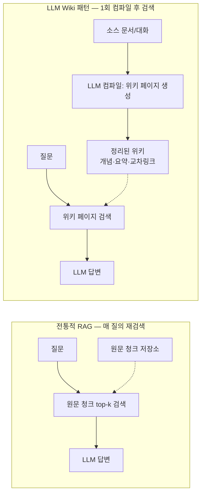

| | 전통 RAG | LLM Wiki 패턴 |
|---|---|---|
| 저장 단위 | 원문 청크 | LLM이 정리·합성한 페이지 |
| 지식 작업 시점 | 매 질의 (query-time) | 인제스트 1회 (compile-time) |
| 누적 효과 | 없음 | 지식이 축적·자기조직화 |
| 검색 대상 | 잡음 섞인 원문 조각 | 정제된 개념 페이지 |

> **정밀 인용 도메인 시사점**: 정확한 문단 인용이 생명인 도메인에선 **무벡터(vectorless) + 컴파일된 색인** 방식이 벡터 RAG보다 안전하다(근사매칭·환각↓).

---

## 2. 세 저장소 상세 — "어떤 형식으로 쓰였고, 무엇에 활용하나"

### 2.1 seCall (`hang-in/seCall`) — 대화 로그 네이티브

| 항목 | 내용 |
|---|---|
| 정체 | AI **대화 로그**를 검색 가능한 Obsidian 위키로 만드는 도구 |
| 작성 형식 | **Rust** CLI + 웹UI / SQLite(FTS5) / MCP 서버 |
| 라이선스 | **AGPL-3.0** (개인 로컬 사용 무제한 · 코드복사/SaaS는 카피레프트) |
| Windows | 프리빌트 zip + `irm …/install.ps1 | iex` (빌드 불필요) |
| 활용 등급 | **실행(run)** — AI 작업 대화 인덱싱에 즉시 적합 |

**동작 형식 (도식)**

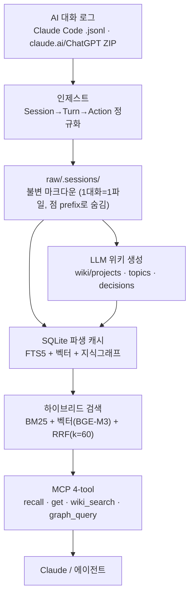

**활용 포인트 (무엇을 빌리나)**
- **2-tier 볼트**: `raw/.sessions/`(불변 원문) + `wiki/`(생성 지식) 분리.
- **마크다운=진실, DB=파생 캐시**: `.db`를 gitignore → 어느 기기서든 마크다운 재인덱싱으로 복원.
- **CLAUDE.md/SCHEMA.md = in-band 스키마 계약**: LLM과 데이터가 같은 규약을 공유.
- **4-tool MCP 인터페이스**: recall(키워드+의미+시간) / get / wiki_search / graph_query.
- (직접 만들 때) Claude Code 디스크 레이아웃 등 **포맷 사실**은 코드가 아니라 지식이므로 자유롭게 재구현 가능.

---

### 2.2 OpenKB (`VectifyAI/OpenKB`) — 컴파일 두뇌 (라이선스 최선)

| 항목 | 내용 |
|---|---|
| 정체 | **문서**(PDF/URL/파일)를 LLM이 위키로 컴파일하는 CLI |
| 작성 형식 | **Python** (`pip install openkb`) / PageIndex 무벡터 검색 / LiteLLM |
| 라이선스 | **Apache-2.0** (가장 자유 · 코드 복사 합법) |
| Windows | pip 설치 가장 깔끔 |
| 활용 등급 | **차용(steal)** — 컴파일 프롬프트·스키마가 보석 |

**동작 형식 (도식)**

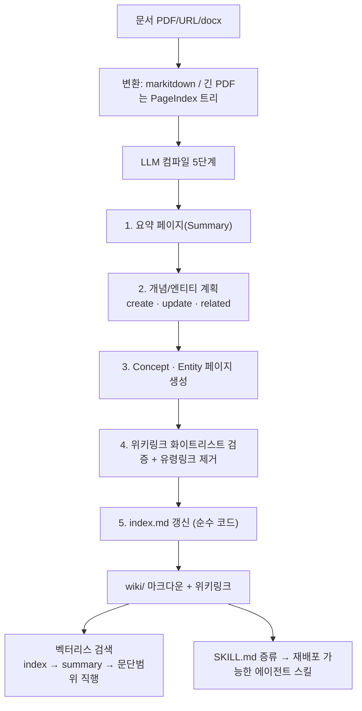

**활용 포인트 (보석들)**
- **3-타입 분류**: `Summary`(소스당 1개) / `Concept`(추상·반복 아이디어, 핵심가치) / `Entity`(고유명사).
- **누적 엔진(create/update/related)**: "겹치면 새로 만들지 말고 update" → 위키가 중복 폭증 없이 성장.
- **위키링크 화이트리스트 + 유령링크 제거**: LLM이 깨진 링크를 못 만들게 원천 차단.
- **벡터리스 PageIndex**: `{title, 문단범위, summary}` 트리를 읽고 LLM이 좁은 범위로 직행 → 임베딩 불필요.
- **SKILL.md 증류 프롬프트**: 코퍼스에서 재배포 스킬을 자동 생성.

---

### 2.3 llm_wiki (`nashsu/llm_wiki`) — 검색·그래프 아이디어 + 즉시 체험

| 항목 | 내용 |
|---|---|
| 정체 | 문서를 위키로 컴파일하는 **데스크톱 앱** |
| 작성 형식 | **Tauri**(React + Rust) / LanceDB 벡터 / 지식그래프 |
| 라이선스 | **GPL-3.0** (코드 복사 시 파생물도 GPL → 패턴만 차용) |
| Windows | **.msi 더블클릭** — 세 개 중 "그냥 써보기" 1등 |
| 활용 등급 | **참고/차용(reference)** — 그래프·캐시 아이디어 |

**동작 형식 (도식)**

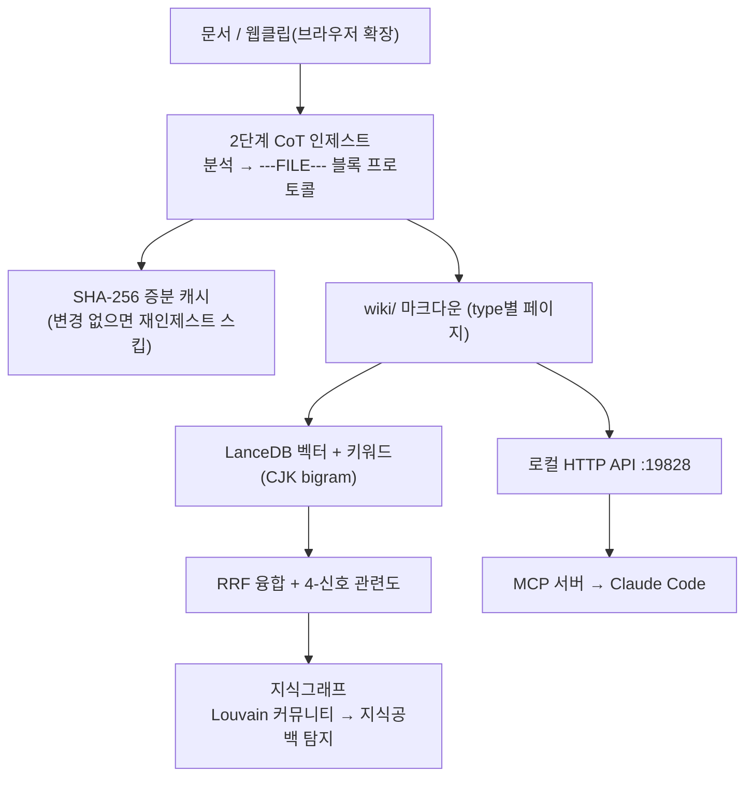

**활용 포인트**
- **4-신호 관련도**: `3.0×직접링크 + 4.0×소스겹침 + 1.5×Adamic-Adar + 1.0×타입친화`. (소스 겹침이 직접 링크보다 강한 관련 신호)
- **Louvain 커뮤니티 → 지식공백 탐지**: 빈약한 클러스터를 "덜 다룬 주제"로 표면화.
- **SHA-256 증분 캐시**: 변환/인제스트 재처리 방지.
- **MCP = 로컬 HTTP 얇은 래퍼**: 앱 UI와 Claude가 하나의 권한모델 공유.
- (주의 정정) 앱 내 **한국어 UI 없음**(README만 다국어), **전용 Claude 스킬 없음**(MCP로만 연동).

---

## 3. 세 저장소 비교 — 활용도 관점

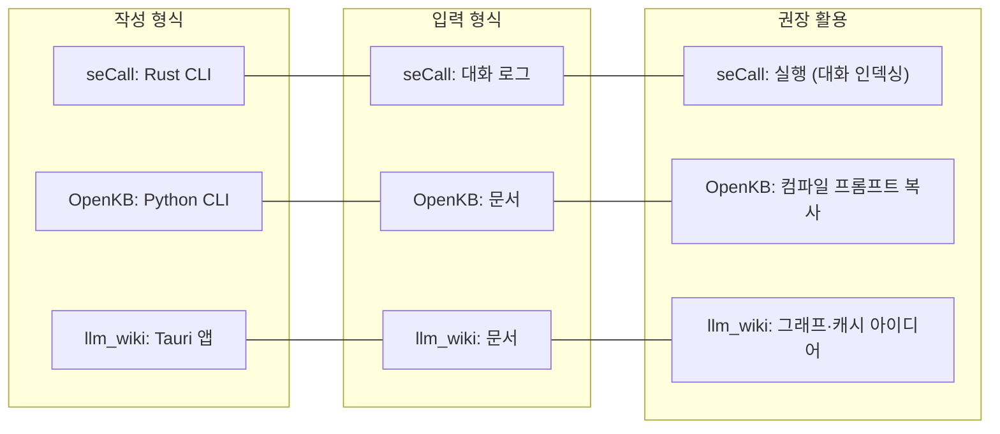

| | seCall | OpenKB | llm_wiki |
|---|---|---|---|
| 작성 형식 | Rust CLI+웹 | Python CLI | Tauri 데스크톱 |
| 입력 | **대화 로그(네이티브)** | 문서 | 문서 |
| 검색 | BM25+벡터+RRF | **무벡터(PageIndex)** | 벡터+키워드+그래프 |
| 라이선스 | AGPL-3.0 | **Apache-2.0(최선)** | GPL-3.0 |
| Windows | 프리빌트 설치 | pip | **.msi 1클릭** |
| 한 줄 활용 | **지금 실행** | **프롬프트 차용** | **아이디어 차용** |

> 공통점: 셋 다 **in-band 스키마 계약 + 마크다운 볼트 + Obsidian 호환 + 검색/MCP 노출**.

---

## 4. 정밀 인용 도메인 지식베이스에의 적용 (일반화 예시)

정확한 문단 인용이 중요한 도메인(법령·기준서·규정·표준문서 등)에서 위 패턴을 어떻게 쓸지 일반화한 설계다. 핵심은 "원문은 불변, 색인은 재생성, 검색은 무벡터 우선, 권위는 항상 원문 문단에 둔다"이다.

### 4.1 권장 골격

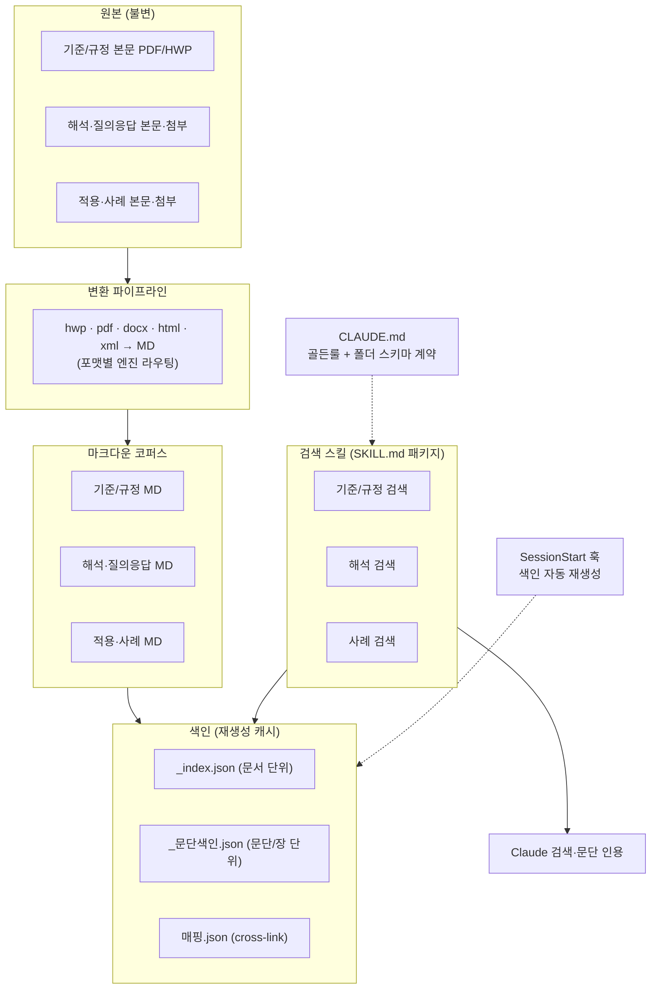

### 4.2 이미 좋은 패턴 (정밀 인용 도메인이 갖춰야 할 것)

- **스키마 계약(CLAUDE.md) + 재생성 색인 + SKILL 검색 + 무벡터 네비게이션**("색인→목차→Grep→인용")을 갖추면 seCall/OpenKB 핵심 패턴을 사실상 구현한 것.
- **정합성 검증**: 본문 MD 누락 0, 본문 경로 누락 0 같은 무결성 점검을 자동화.
- **문단 reference 고정**: "제1115호 문단 31"처럼 인용 단위를 고정해 권위를 원문에 둠.

### 4.3 흔한 약점 (우선순위순)

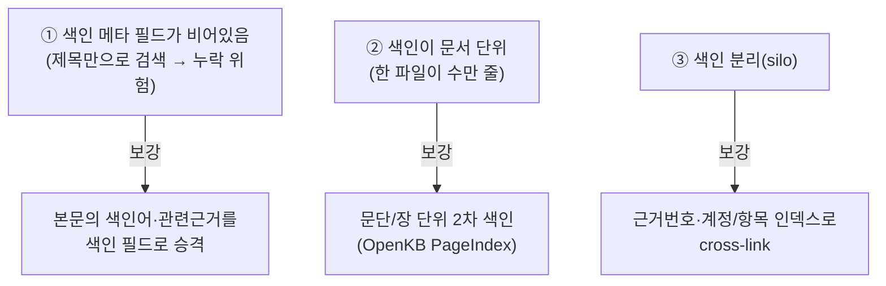

| 약점 | 증상 | 고치면 |
|---|---|---|
| **①** 색인 메타 빈값 | 제목 밖 키워드로 검색 불가 | 키워드·근거번호로 검색 → 누락↓ 적중↑ |
| **②** 문서 단위 색인 | 큰 파일 통독 필요 | "문단 31 = N줄"로 직행 → 속도·정확도↑ |
| **③** 색인 사일로 | 한 항목 보려 여러 번 검색 | 항목/번호 하나로 동시 소환 |

### 4.4 저장소 아이디어 → 적용 판정표

| 저장소 아이디어 | 판정 | 이유 / 적용 |
|---|---|---|
| OpenKB **Concept 페이지** | 최고가치 | `concepts/<주제>.md` = 본문문단+해석+사례를 **링크 허브**로 묶음 |
| OpenKB **위키링크 화이트리스트** | 채택 | 링크 달면 깨진 링크 방지 |
| OpenKB **SKILL.md 증류** | 보류 | 스킬이 이미 고품질 수제면 우선순위 낮음 |
| llm_wiki **SHA-256 캐시** | 채택 | 변환 재처리 스킵 |
| llm_wiki **sourceOverlap 랭킹** | 부분 | "같은 근거번호 인용=관련" 싼 신호만 차용 |
| llm_wiki **벡터/LanceDB** | 보류 | 무벡터가 정밀 인용엔 더 안전 |
| llm_wiki **Louvain 지식공백** | 제외 | 정제 코퍼스엔 과함 |
| seCall **MCP 4-tool** | 채택 | 규모 커지면 graph_query 도입 |
| seCall **2-tier 볼트/마크다운=진실** | 채택 | 원본+MD+재생성 색인 = 동일 원칙 |
| seCall **대화 인제스트/디스크 레이아웃** | 제외 | 채팅 로그용 — 문서 KB와 용도 불일치 |

> **정밀 인용 도메인 안전장치**: Concept 허브 페이지는 **링크 + 한 줄 포인터로만** 작성하고 규정 재서술은 금지한다. 권위는 원문 문단에 두고 페이지는 길잡이 역할만(합성문이 원문과 어긋나는 위험 차단).

### 4.5 목표 검색 흐름 (개선 후)

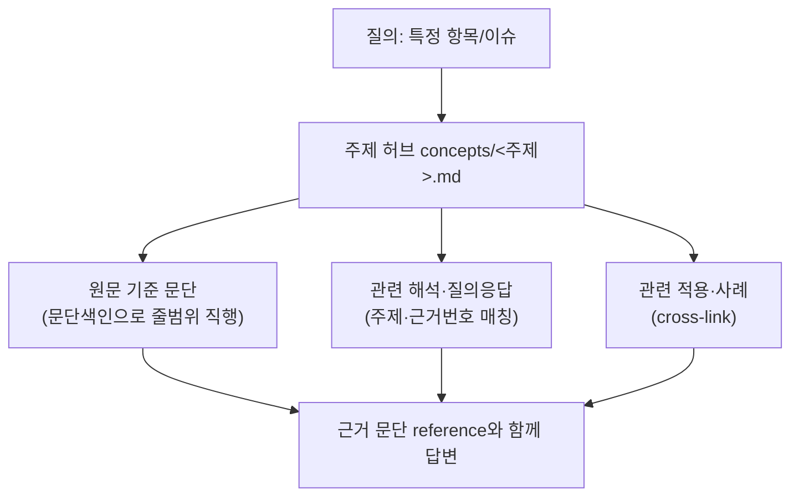

### 4.6 실행 로드맵 (우선순위)

| 순서 | 작업 | 비용 | 효과 | 출처 아이디어 |
|---|---|---|---|---|
| 1 | 색인 메타(`주제`/관련근거) 채움 | 낮음 | 높음(누락↓) | (자체) |
| 2 | 변환 SHA-256 캐시 | 낮음 | 중(속도) | llm_wiki |
| 3 | 문단 PageIndex `_문단색인.json` | 중 | 높음("문단 직행") | OpenKB |
| 4 | 근거번호·항목 인덱스 cross-link | 중 | 높음(1홉 소환) | llm_wiki·seCall |
| 5 | 주제 허브 페이지(+링크 검증) | 중상 | 높음(진입점) | OpenKB·seCall |
| 6 | MCP 구조화 검색 | 상 | 중(규모↑ 시) | seCall·llm_wiki |

> 별개 트랙(보완재): 도메인 권위 코퍼스와 겹치지 않는 별도 용도로, AI 작업 **대화 기록**을 seCall로 인덱싱해 "이전에 이 이슈 어떻게 처리했는지"를 검색하는 second-brain화도 가능하다. 권위 코퍼스와는 분리 운영한다.

---

## 5. 비정형 문서 파싱·색인 파이프라인 (활용도)

> hwp · hwpx · pdf · docx · html · xml 등 **비정형 텍스트·표·이미지**를 거의 100% 정확히 MD로 변환·파싱하고, 로컬 색인으로 LLM이 빠르고 정확하게 가져오게 하는 실전 설계.

### 5.1 핵심 진실 — "거의 100%"는 파서가 아니라 *검증*의 문제

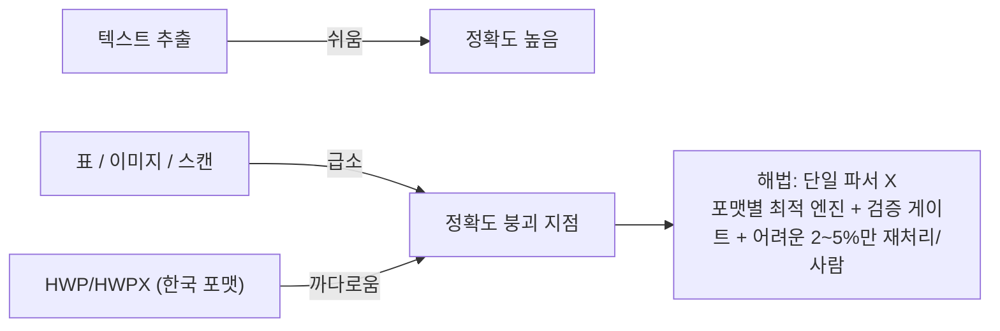

- 텍스트는 쉽다. **정확도가 무너지는 곳은 ① 표 ② 이미지/스캔 ③ HWP/HWPX**. 재무·수치 자료는 **표가 급소**.
- 단일 파서로 100%는 환상. 현실적 "거의 100%" = **포맷별 엔진 + 검증 게이트 + 어려운 부분만 사람/재처리**. ("목차/섹션 확인 + 저신뢰 플래그"를 전 포맷으로 일반화하는 게 정답)

### 5.2 포맷별 엔진 (현재 vs 업그레이드)

| 포맷 | 흔한 현재 | 권장 | 표·이미지 처리 |
|---|---|---|---|
| **HWP/HWPX** | kordoc | **kordoc 유지(한국 포맷 최강·병합셀/중첩표 보존)**. HWPX는 XML(zip) 직접 파싱도 안정 | 어려운 표는 `hwp` MCP `get_table_data`로 셀단위(COM=최고 충실도) |
| **복잡표 PDF (재무제표)** | PyMuPDF+pdfplumber | **Docling(TableFormer) / MinerU(CJK) 추가** | ML로 병합셀·다단 표 복원 |
| **디지털 텍스트 PDF** | kordoc/PyMuPDF | **PyMuPDF4LLM**(빠름) | 표만 pdfplumber 보조 |
| **스캔/이미지 PDF** | — | **OCR: Upstage Document Parse(한국어 95%+)·Naver Clova / VLM** | 표-in-이미지는 VLM 캡션 |
| **docx/pptx/xlsx** | openpyxl 등 | **markitdown(MCP 연결)** / xlsx는 openpyxl 유지 | docling이 표 더 정확 |
| **html** | Readability+Turndown | 유지 / trafilatura 대안 | — |
| **xml** | 스키마별 커스텀(DSD) | **유지가 정답** | — |

> 한 줄: **HWP=kordoc(+hwp MCP 표추출), 재무제표 PDF=Docling/MinerU**. 추가할 단 하나는 **복잡표 PDF용 Docling**.

### 5.3 표·이미지 특수처리 (정확도의 급소)

- **표**: MD 표 또는 **HTML로 보존**(병합셀은 HTML이 안전). 표마다 캡션·위치를 메타로 → "그 표" 직접 호출.
- **이미지/도표**: (a) **VLM 캡션**(vision으로 설명 생성) 또는 (b) figure 참조 보존.
- **산술 검증(수치 도메인 무기)**: 재무·정산 표는 **차변=대변·소계=합계**로 파싱 오류를 *자동* 탐지 — 텍스트 도메인엔 없는 "거의 100%" 무기.

### 5.4 검증 게이트 — "거의 100%"의 실제 비결 + 전체 파이프라인

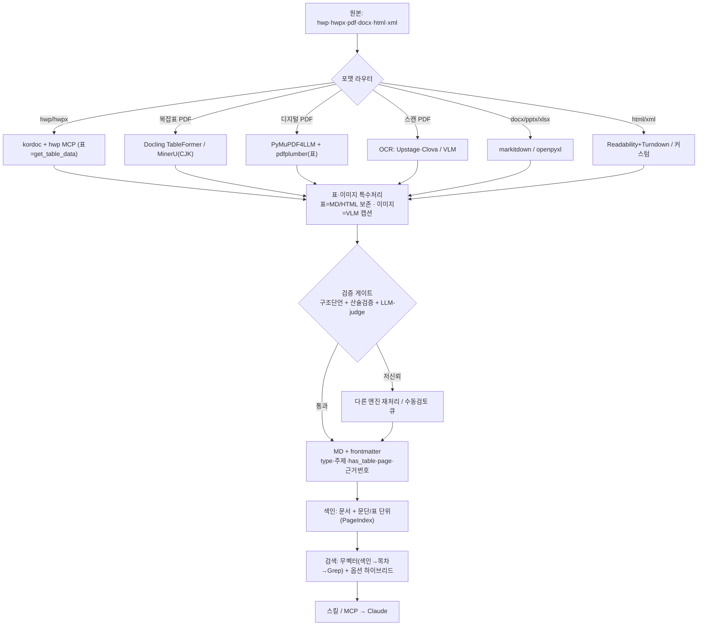

검증 게이트(통과 / 저신뢰 / 수동 3분기):
1. **구조 단언** — 기대 섹션 존재? 표 개수=원본? 페이지수 일치? 빈 셀 비율 초과?
2. **산술 검증(수치 도메인)** — 표 합계 일치 여부.
3. **LLM-judge(저신뢰·샘플만)** — 원본 페이지 이미지 vs 변환 MD 대조로 표 누락·깨짐 탐지.
4. **confidence < 임계 → 다른 엔진 재처리 또는 수동검토 큐.** ← 100%로 수렴시키는 유일한 현실적 방법.

### 5.5 색인 + RAG (정확 검색의 절반은 *메타*)

- **2단 색인**: 문서 색인 + **문단/표 단위 PageIndex**(`{제목, 줄범위, has_table}`) → "그 표/문단 직행".
- **frontmatter 메타**: `source · type · 주제 · has_table · has_image · page · 근거번호`. 적중률은 메타가 좌우.
- **검색**: **무벡터(색인→목차→Grep)** 우선(정확 인용 도메인 최적). 모호 질의용으로만 **벡터 하이브리드(BM25+벡터+RRF)** 옵션.
- **노출**: 스킬 → 규모 커지면 **MCP 구조화 검색**.

### 5.6 지금 바로 쓸 수 있는 도구 (설치 불필요한 MCP 예)

| 도구 | 활용 |
|---|---|
| **`hwp` MCP 서버** | `get_table_data`/`get_tables`(표 고충실도), `export_page_as_image`(검증용 페이지 이미지 → LLM-judge), `get_document_text` |
| **`markitdown` MCP** | docx/pptx/xlsx/html 빠른 변환 |
| **`pandoc` MCP** | 포맷 상호변환 보조 |
| 추가 설치 1순위 | **Docling**(재무제표 PDF 표) · 필요 시 **Upstage Document Parse**(스캔 한국어) |

### 5.7 우선순위 (활용도)

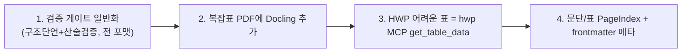

1. **검증 게이트 일반화** — "저신뢰 플래그"를 전 포맷으로(구조단언+산술검증). 거의 100%의 핵심, 비용 낮음.
2. **재무제표/복잡표 PDF에 Docling** — 표 충실도가 가장 약한 지점 보강.
3. **HWP 어려운 표는 hwp MCP `get_table_data`** — COM 기반 최고 충실도.
4. **문단/표 단위 PageIndex + frontmatter 메타** — 빠르고 정확한 검색의 절반.

### 5.8 참고 도구·출처

- [kordoc](https://github.com/chrisryugj/kordoc) (HWP3-5·HWPX·HWPML·PDF·Office → MD) · [hwp-parser](https://github.com/HariFatherKR/hwp-parser) · [file2md](https://github.com/ricky-clevi/file2md)
- [PDF→MD 도구 비교 2026](https://themenonlab.blog/blog/best-open-source-pdf-to-markdown-tools-2026) · [Docling vs MarkItDown](https://www.file2markdown.ai/blog/docling-vs-markitdown) · [Marker](https://github.com/datalab-to/marker)
- [OmniDocBench(문서파싱 벤치마크)](https://github.com/opendatalab/OmniDocBench) · [Upstage](https://www.upstage.ai/)

---

## 부록 A. 출처

- seCall — https://github.com/hang-in/seCall (AGPL-3.0)
- OpenKB — https://github.com/VectifyAI/OpenKB (Apache-2.0)
- llm_wiki — https://github.com/nashsu/llm_wiki (GPL-3.0)
- 패턴 원류 — Andrej Karpathy의 "LLM Wiki" (원문을 점진적으로 지식베이스로 컴파일)

## 부록 B. 라이선스 주의

| 저장소 | 라이선스 | 코드 복사 | 개인 로컬 실행 |
|---|---|---|---|
| seCall | AGPL-3.0 | ❌(카피레프트·네트워크 조항) | 무제한 |
| OpenKB | Apache-2.0 | ✅(출처표기) | 가능 |
| llm_wiki | GPL-3.0 | ❌(파생물 GPL) | 가능 |

> 데이터 포맷·알고리즘·프롬프트 **아이디어**는 저작권 대상이 아니므로 재구현은 모두 자유. "코드 복붙"만 라이선스 확인 필요.

## 부록 C. 용어

- **in-band 스키마 계약**: 데이터 폴더 안에 규약 문서(CLAUDE.md/SCHEMA.md/AGENTS.md)를 두어 LLM과 데이터가 같은 규칙 공유.
- **무벡터(vectorless) 검색**: 임베딩 없이 색인·목차·Grep으로 탐색(OpenKB PageIndex).
- **PageIndex**: 문서를 `{제목, 문단/페이지 범위, 요약}` 트리로 색인해 좁은 범위로 직행하는 방식.
- **RRF(Reciprocal Rank Fusion)**: 여러 검색결과를 `Σ 1/(k+rank)`로 융합(k=60).
- **cross-link / sourceOverlap**: 같은 근거(번호)를 공유하는 자료를 연결·관련도 가중.
