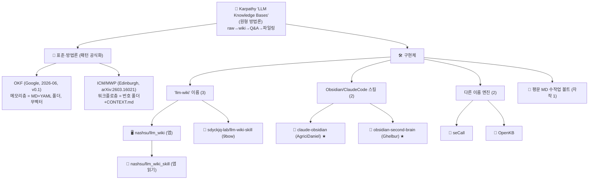

# LLM Wiki 종류 정리

> **범위 주의** — 인터넷 전수 조사가 아니라, 공개 자료와 1차 저장소에서 확인한 범위의 분류다. 새 구현체가 나오면 한 줄씩 추가한다. (★ 표시 = 1차 출처로 팩트체크 완료)

## 한눈에 — 개수

| 계층 | 개수 | 무엇 |
|---|---|---|
| 방법론(원형) | **1** | Karpathy "LLM Knowledge Bases" |
| 표준·방법론(공식화) | **2** | OKF(메모리층) · ICM/MWP(워크플로층) |
| 구현체 | **8** | 앱 1 · 스킬/플러그인 4 · 엔진 2 · 평문MD 자작 1 |

→ **방법론 1 + 표준 2 + 구현 8**

## 계보 도식

## 표준·방법론 (검증됨 ★)

| 이름 | 발행 | 무엇 | 비고 |
|---|---|---|---|
| **OKF** (Open Knowledge Format) | Google Cloud, **2026-06-13, v0.1 Draft** | "LLM-wiki 패턴을 이식 가능 포맷으로 공식화" — MD+YAML 폴더, 필수필드 `type` 1개, **무벡터·무런타임** | repo `GoogleCloudPlatform/knowledge-catalog`. "완성 표준" 아님(Draft) |
| **ICM / MWP** | Edinburgh, **arXiv:2603.16021** (2026-03) | 번호 폴더(01_research…)+`CONTEXT.md`로 단계별 단일 에이전트 워크플로 | 정식 제목 *Interpretable Context Methodology*. 저자 Van Clief·McDermott. 참조구현 `RinDig/Interpreted-Context-Methdology` |

## 구현체 비교표

| # | 이름 | 형태 | 핵심 | 라이선스 | 검증 메모 |
|---|---|---|---|---|---|
| 1 | **nashsu/llm_wiki** | 데스크톱 앱(Tauri) | 벡터(LanceDB)+Louvain 그래프+Deep Research | GPL-3.0 | ⭐12.4k, v0.4.25 |
| 2 | **sdyckjq-lab/llm-wiki-skill** (9bow) | 에이전트 스킬 | 평문MD 자동생성+그래프HTML+신뢰도태그 | MIT | v3.6.9 |
| 3 | **nashsu/llm_wiki_skill** | 앱 동반 스킬 | 떠 있는 앱에 읽기전용 질의 | (앱 부속) | — |
| 4 | **claude-obsidian** (AgriciDaniel) ★ | Claude Code 플러그인 | **15스킬**·hot cache·병렬 ingest·`/autoresearch`·6툴 설치 | MIT | ⭐**7.3k**(글의 358 ❌)·v1.9.2 |
| 5 | **obsidian-second-brain** (Ghelbur) ★ | 크로스-CLI 스킬 | 43+ 슬래시명령, AI-first 볼트 | MIT | ⭐**2.6k**(글의 3000/1374 ❌). **OKF 미구현** |
| 6 | **seCall** | Rust 엔진/MCP | FTS5+벡터 RRF, 4-tool | AGPL-3.0 | 3대저장소 분석 |
| 7 | **OpenKB** | Python | 무벡터 PageIndex, 위키링크 화이트리스트 | Apache-2.0 | 3대저장소 분석 |
| 8 | **평문 MD 수작업 볼트** | 수작업 볼트 | 평문MD + 인간 큐레이션 | (개인) | 무벡터 노선 |

## 헷갈리는 "llm-wiki 3총사"

- `nashsu/llm_wiki` = **앱** · `nashsu/llm_wiki_skill` = 그 앱의 **읽기 스킬** · `sdyckjq-lab/llm-wiki-skill`(9bow) = 앱 없이 **단독 생성** 스킬.

## 보조 분류 — 검색 방식

- **벡터(임베딩)**: nashsu/llm_wiki(선택), seCall
- **무벡터(grep·구조·PageIndex)**: OpenKB, llm-wiki-skill, claude-obsidian, obsidian-second-brain, 평문 MD 수작업 볼트

---

*평문 MD·무벡터·MIT·Claude Code 노선에 맞는 1순위는 **claude-obsidian(4)** 또는 **llm-wiki-skill(2)**. 표준은 **OKF**(메모리)·**ICM**(워크플로). 갱신: 2026-06-22, 4건 1차 출처 팩트체크 반영.*
