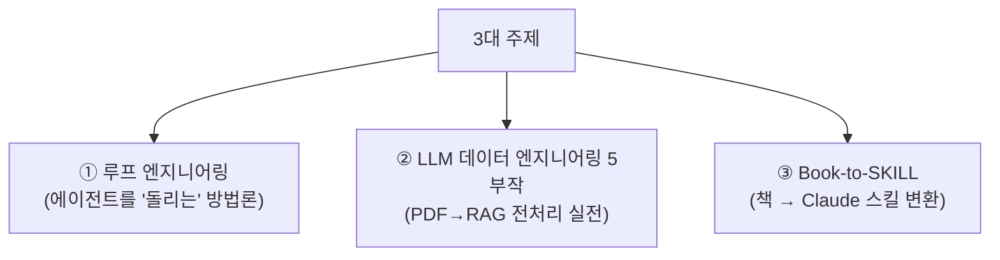
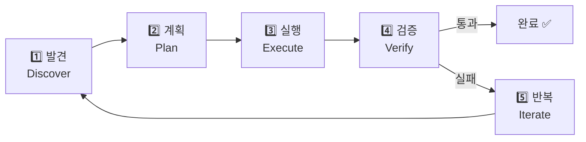
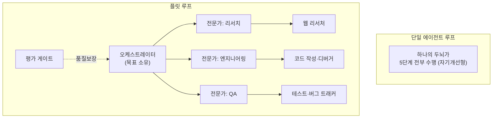
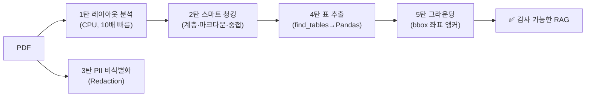
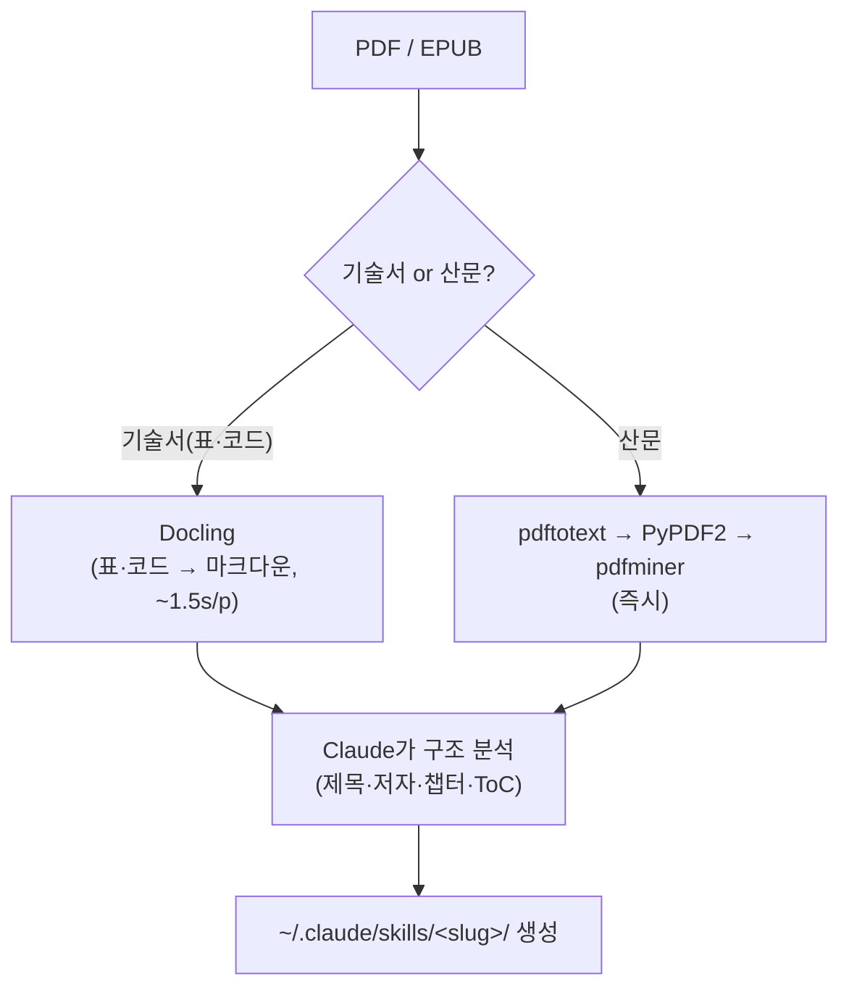
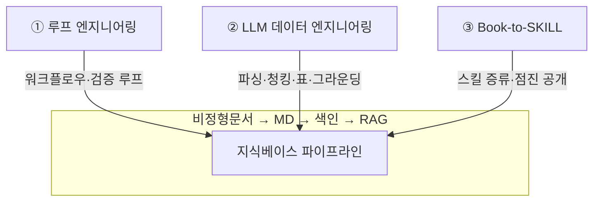

# 루프 엔지니어링 · LLM 데이터 엔지니어링 · Book-to-SKILL

> 외부 자료(아티클·기술블로그·GitHub repo) 정리 + 팩트체크. 비정형 문서를 MD로 바꿔 색인하고 RAG·검증·스킬·워크플로우로 잇는 실무 주제와 직결된다.

## 한눈에 보기



| 주제 | 한 줄 요약 |
|---|---|
| **루프 엔지니어링** | "프롬프트 쓰지 말고 **루프를 설계**하라" |
| **LLM 데이터 엔지니어링** | PDF를 RAG용으로 만드는 **5단계 실전 기술** |
| **Book-to-SKILL** | 책을 **컴파일해 스킬로** 만들어 온디맨드 호출 |

---

# ① 루프 엔지니어링 (Loop Engineering)

## 핵심 개념 — "프롬프트"에서 "루프"로

AI 에이전트가 사람 개입 없이 **스스로 발견→계획→실행→검증→반복**하는 피드백 사이클을 설계하는 방법론. 2026년 두 시니어가 같은 메시지를 던지며 주목받았다.

> 🗣️ **Peter Steinberger**: "이제 코딩 에이전트에 프롬프트를 쓰지 말고, **프롬프트를 보내는 루프를 설계**하라."
> 🗣️ **Boris Cherny** (Claude Code, Anthropic): "나는 더 이상 Claude에 직접 프롬프트하지 않는다. **루프를 작성하는 것이 내 일**이다."

기존엔 **사람이 루프 역할**(지시→검토→수정→재지시)을 했다면, 루프 엔지니어링은 그 사이클 전체를 **시스템이 자동 수행** → 개발자는 목표만 설정한다.

## 5단계 사이클



> 골격: **목표 → 행동 → 확인 → 수정 → 완료까지 반복**

## 실제로 구축해야 할 6가지 구성요소

| 구성요소 | 역할(비유) | 내용 |
|---|---|---|
| **오토메이션** | 심장박동 | 루프가 *언제* 시작될지. 일정·조건 충족까지 반복하는 트리거 |
| **워크트리** | 병렬 충돌 방지 | git worktree로 에이전트마다 격리된 작업 디렉터리·브랜치 |
| **스킬** | 누적되는 지식 | `SKILL.md`(컨벤션·빌드·금기). 보통 VISION·ARCHITECTURE·RULES |
| **플러그인·커넥터** | 실제 도구 연결 | MCP 기반. 이슈 트래커·DB·API·Slack까지 직접 처리 |
| **서브에이전트** | 메이커/체커 분리 | 작성한 모델이 자기 채점하면 관대해짐 → **다른 에이전트가 검증** |
| **메모리** | 지속성(척추) | 대화 밖 마크다운/보드에 기록 → 다음 날 멈춘 지점부터 재시작 |

## 두 가지 규모 · 두 가지 유형

**규모: 단일 에이전트 루프 vs 플릿(Fleet) 루프**



**유형: 오픈 루프 vs 클로즈드 루프**

| | 오픈 루프 (Open) | 클로즈드 루프 (Closed) ✅ |
|---|---|---|
| 성격 | 탐색적, 넓은 행동공간 | 경계 명확, 사람이 경로 설계 |
| 장점 | 미명세 영역도 발견·구축 | 신뢰성, 예산 내 운영, 매 실행 개선 |
| 단점 | **토큰 폭증**(대부분에게 비실용) | 자유도 제한 |
| 권장 | — | **오늘날 실용적 선택**. 먼저 타이트하게 만들고 점진적으로 개방 |

## 4가지 대표 루프 패턴

| 패턴 | 흐름 |
|---|---|
| **코딩** | VISION·ARCHITECTURE 읽기 → 계획 → 편집 → 테스트 → (실패 시 수정·재테스트) → 통과 시 요약 |
| **리서치** | 질문 정의 → 검색 → 요약 → 출처 대조 → 상충 비교 → 합성 → 신뢰도 임계 시 종료 |
| **콘텐츠** | 주제·대상 정의 → 초안 → 크리틱 검토 → 재작성 → 점수화 → 통과 시 게시 |
| **세일즈** | ICP 정의 → 리드 발굴 → 데이터 보강 → 적격 판정 → 개인화 → 검토 → 전송/에스컬레이션 |

## 비용 — 숨은 장벽

| 규모 | 토큰 |
|---|---|
| 단일 에이전트, 중간 코딩 | 5만~20만 |
| 오케스트레이터+전문가 3명 | 50만~200만 |
| 매일 아침 스케줄 실행 | 주간 수백만 |

→ **돌파구로 거론되는 것: 저가·대용량 컨텍스트 LLM**(예: DeepSeek 계열). 1M 컨텍스트, 대용량 출력, 극저가, 높은 동시성. 1M 컨텍스트가 중요한 건 **루프엔 메모리가 필요**하기 때문(이전 실행·오류·아키텍처·테스트를 동시에 기억).

> ℹ️ 모델 스펙·가격은 빠르게 바뀌므로 적용 전 공식 문서로 재확인할 것.

## 프롬프트 엔지니어 → 루프 엔지니어

> 프롬프트 엔지니어는 **결과물을 요청**, 루프 엔지니어는 **검증된 결과를 만드는 시스템을 설계**한다.
> ⚠️ **경고**: 같은 루프라도 "이해를 *깊게* 하려" 쓰면 가속기, "이해를 *피하려*" 쓰면 독이 된다. 루프는 그 차이를 모른다 → 루프 설계가 프롬프팅보다 *더 어려운* 이유.

---

# ② LLM 데이터 엔지니어링 5부작 (epapyrus)

> PDF를 RAG용 데이터로 만드는 전처리 실전 시리즈. **"비정형 문서 → MD → 검증" 파이프라인에 바로 쓸 수 있는 기술 묶음.**



### 1탄 — GPU 없이 PDF 레이아웃 분석 (PyMuPDF-Layout)
- 표·제목·본문 구분을 보통 LayoutLM·YOLO(GPU)로 하지만 수백만 페이지엔 비용이 과다하다.
- **PyMuPDF-Layout**: PDF 내부 폰트 메타데이터·좌표·휴리스틱으로 **"추론"이 아닌 "구조적 분석"** → **CPU로 페이지당 ~0.1초(약 10배↑)**.
- DocLayNet 벤치마크: **F1 0.827**(PDF피처) / **0.836**(퓨전) vs Docling RT-DETR **0.810** — **파라미터 15배↓, GPU 불필요인데 정확도는 동급↑**.
- 강점: 구조화 텍스트(footnote·title·list). 약점: **picture(-0.38)·복잡한 표**(퓨전이 표 격차는 거의 해소).

### 2탄 — 스마트 청킹 (Smart Chunking)
- ❌ 기계적 고정길이(500/1000자)는 **표·문장 한복판에서 잘림**(의미 단절·인덱싱 오염).
- ✅ **3대 전략**: ① **계층적 청킹**(H1/H2/H3 섹션 단위, 제목을 청크에 포함) ② **마크다운 기반 청킹**(`###`·`|---|` 구조 → **LLM 추론 정확도 +20~30%**) ③ **지능적 중첩**(문장·단락 끝에서 마감).
- 📊 **표는 마크다운 테이블로 통째로 한 청크에** → LLM이 행/열 관계를 완벽히 이해.

### 3탄 — PII 영구 삭제 (Redaction)
- ⚠️ **마스킹**(검은 박스)은 PDF 객체 스트림에 **원문이 남아** 복사·추출 시 노출된다.
- ✅ **Redaction**: 지정 영역 텍스트·이미지를 **바이너리 수준에서 영구 삭제**. PyMuPDF + **`garbage=4`**로 잔존 0.
- 좌표는 유지 → 1탄·2탄 파이프라인에 영향 없음. **사후 `get_text()` 재검출로 Double-check 필수.**

### 4탄 — PDF 표 추출 → Pandas
- PDF엔 '표 객체'가 없고 선·좌표만 있음 → 그냥 추출하면 한 줄로 뭉개진다(병합셀·테두리 없는 표는 더 어려움).
- **`page.find_tables()` → `.extract()` → `pd.DataFrame`**. 경계선이 없으면 `vertical_strategy` 등 옵션을 조절.
- `to_markdown`으로 변환해 2탄 청킹과 연동.

```python
import fitz, pandas as pd
tabs = page.find_tables()
data = tabs[0].extract()
df = pd.DataFrame(data[1:], columns=data[0])
```

### 5탄 — 공간 좌표 기반 그라운딩 (Grounding)
- **그라운딩 = AI 출력을 원본 근거에 단단히 고정**. 측량학의 *Ground Truth*(현장 실측값)에서 유래.
- LLM은 **토큰 공간**에서만 작동 → 문서의 물리적 위치를 모른다. "몇 번째 문단"식 참조는 렌더링·청킹에 따라 어긋난다.
- 반면 PDF 문자의 **물리 좌표(bbox)**는 **변하지 않는 결정론적 Source of Record**다.
- 인덱싱 때 텍스트 좌표를 메타데이터로 저장 → 쿼리 때 `search_for()`로 답변의 실제 위치를 찾아 검증·하이라이트.

```python
blocks = page.get_text("blocks")          # (x0,y0,x1,y1, text, ...)
chunks.append({"page": n, "text": text, "bbox": list(rect)})  # 공간 앵커
hits = page.search_for("net revenue declined")   # 주장의 물리적 위치 검증
page.add_highlight_annot(hits)
```

- 효과: **시각적 인용**(원본 하이라이트) · **RAG 체크섬**(bbox로 엉뚱한 청크 필터링) · **구조적 공간 필터링**(`find_tables` 좌표 ∩ 글자 좌표로 "어느 표의 합계"인지 수학적으로 특정) · **크로스모달 그라운딩**.

> 💡 **응용 메모**: 이 5부작은 "거의 100% 정확 + 감사 가능"을 목표로 하는 실전 레시피다. 특히 5탄(그라운딩)은 **정밀 인용이 필요한 도메인**(예: 규정·기준서 인용)에서 근거를 **문단번호가 아니라 좌표로 고정**해 *정확성·신뢰성*을 높이는 데 유용하다. 이는 데이터 자동화·전처리 기법일 뿐, 특정 도메인의 전문 판단(예: 회계판단·투자권유)을 대체하지 않는다.

---

# ③ Book-to-SKILL — 책을 Claude 스킬로 변환

## 핵심 발상 — 검색(Retrieval)과 추론(Reasoning) 분리
- 기술서를 매번 컨텍스트에 붙이면 **한 권 ≈ 200K 토큰**. RAG는 "이 부분에 뭐라 적혔나"엔 강하지만 **책 전체의 프레임워크·안티패턴·결정규칙**은 못 가져온다.
- **Book-to-SKILL**: **컴파일 시점에 한 번 깊이 분석** → 멘탈모델·패턴·용어집·결정표·챕터요약을 미리 추출. 사용 시점엔 그 구조화 자료로 추론.

## 동작 흐름



> 벤치마크(103p 기술서): `pdftotext` 0.1초·표 0개 vs **`docling` 164초·표 48개·코드 36개 보존** → 책 성격에 맞춰 도구 자동 선택.

## 산출물 구조 (토큰 예산 분리 = 점진적 공개)

| 파일 | 토큰 | 역할 |
|---|---|---|
| `SKILL.md` | ~4,000 | 핵심 멘탈모델 + 챕터 인덱스(진입점) |
| `chapters/chNN.md` | ~1,000/장 | 챕터 요약 — **물어볼 때만 로드** |
| `glossary.md` | ~1,500 | 용어집(등장 챕터 표시) |
| `patterns.md` | ~2,000 | 반복 기법·알고리즘·디자인 패턴 |
| `cheatsheet.md` | ~1,000 | 결정표·빠른 참조 규칙 |

## 5가지 설계 원칙
1. **밀도 > 완결성** — 잘 만든 1,000토큰 요약 > 10,000토큰 발췌
2. **실무자 어조** — "X는 Y한 경우에 쓴다"(행동 지향)
3. **첫 5,000토큰에 핵심 전면 배치**(컴팩션 생존)
4. **챕터 요약은 사용 시점에만 로드**
5. **원문 복사 금지, 항상 요약·구조화**(신호만 남김)

> 라이선스 MIT · NotebookLM처럼 80권 횡단 검색용은 아님(한 권 깊이 파기용, 비교는 RAG 병행).

> 💡 **응용 메모**: "컴파일 시점에 미리 정리 → 필요할 때만 로드"는 progressive disclosure 사상 그대로다. 주제 허브·문단 단위 인덱싱 같은 지식베이스 설계에 5원칙(밀도·온디맨드 로드)을 그대로 차용할 수 있다.

---

# 🔗 종합 — 세 조각의 역할



| 가져올 것 | 어디서 | 적용 포인트 |
|---|---|---|
| **클로즈드 루프 + 서브에이전트 검증** | ① 루프 | 검증 게이트를 "별도 에이전트 채점"으로 정직하게 |
| **마크다운 청킹(+20~30%) · 표=마크다운** | ② 2·4탄 | 문서 청킹 품질↑ |
| **좌표 기반 그라운딩(bbox)** | ② 5탄 | "환각 없는 감사 가능" 인용 |
| **PyMuPDF-Layout(CPU 10배)·find_tables** | ② 1·4탄 | 대량 PDF 저비용 전처리 |
| **Redaction(garbage=4)** | ② 3탄 | 공유 데이터 PII 영구 삭제 |
| **컴파일 후 온디맨드 로드 · 밀도 우선** | ③ Book-to-SKILL | 스킬·주제 허브 토큰 효율 |

> **한 줄**: ①은 *어떻게 돌릴지*, ②는 *문서를 어떻게 정확히 데이터로 만들지*, ③은 *지식을 어떻게 스킬로 압축할지* — 세 조각이 파이프라인의 **운영·전처리·지식화**를 각각 채운다.

---

## 📎 원문 출처

| 주제 | 글쓴이 | 출처 |
|---|---|---|
| 루프 엔지니어링 | jacey-dong | "Loops: What Every AI Engineer Needs to Know in 2026" (원저 sairahul1, X) |
| LLM 데이터 엔지니어링 1~5탄 | kyounghee.lee (epapyrus) | [epapyrus.tistory.com](https://epapyrus.tistory.com) |
| Book-to-SKILL | 9bow / 박정환 | [github.com/virgiliojr94/book-to-skill](https://github.com/virgiliojr94/book-to-skill) (MIT) |

---
_읽기·학습용 정리 자료이며 구현·자문이 아니다. 벤치마크 수치·스펙·라이선스는 공개 시점 기준이며 적용 전 원문으로 재확인을 권장한다._
