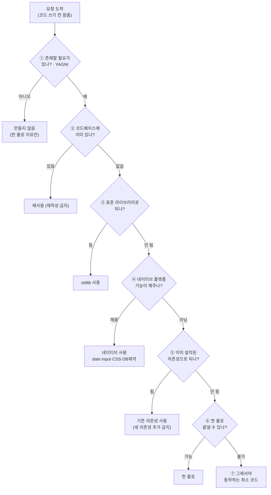

# Ponytail — AI에게 "가장 게으른 시니어 개발자"를 달아주는 스킬

> **무엇** — AI 코딩 에이전트가 코드를 **과하게 짜는 경향**을 잡아, "꼭 필요한 최소한"만 쓰게 만드는 코딩 에이전트 스킬. 레포 한 줄 설명: *"Makes your AI agent think like the laziest senior dev in the room. The best code is the code you never wrote."*(가장 게으른 시니어 개발자처럼 사고하게 — 최고의 코드는 아예 쓰지 않은 코드). 2026-06-12 출시 후 약 12일 만에 **⭐52,497**(MIT)로 폭발적 화제.

## 왜 AI는 코드를 과하게 짜는가 (스킬의 전제)
- LLM은 사용자 요청에 **최대한 친절·풍부하게** 응답하도록 보상학습됨 → 버튼 하나 요청에도 추상화 레이어·의존성·옵션을 덕지덕지 붙임.
- 브라우저/표준이 이미 해주는 것(예: 날짜 선택)도 처음부터 새로 구현. → "똑똑해서 생기는 과설계(over-engineering)".
- Ponytail은 이 폭주에 **브레이크**를 단다: "이거 정말 필요해?"를 먼저 묻는 게으른 시니어.

## 핵심 원리 — "7단계 사다리"(첫 충족 단계에서 멈춤)

> 위에서부터 내려가다 **처음 충족되는 단(rung)에서 멈춘다.** 대부분의 과설계는 ②~④에서 걸러진다(이미 있는 걸 또 짜거나, 표준/네이티브가 해주는 걸 새로 짜는 것).

### "게으른 것이지 소홀한 건 아니다" — 압축 금지 항목
레포 표현은 **"Lazy, not negligent" / "efficient, not careless"**. 다음은 절대 줄이지 않는다:
- 신뢰 경계(trust boundary)에서의 **입력 검증**
- **데이터 손실** 방지 에러 처리
- **보안** · **접근성(accessibility)** 기본
- 사용자가 **명시적으로 요청한 것**
- 비자명 로직(분기·루프·파서·돈/보안 경로) 뒤의 **실행 가능한 검증/테스트**

## 모드 · 명령 · 설치
- **모드 3종(+off)**: `lite`(요청대로 짓되 더 게으른 대안을 한 줄로 제시) · **`full`(기본값** — 사다리 강제, stdlib·네이티브 우선, 최소 diff) · `ultra`("YAGNI 극단주의", 추가보다 삭제 우선) · `off`.
- **명령**: `/ponytail [lite|full|ultra|off]`. 동반 명령 `/ponytail-review`·`-audit`·`-debt`·`-gain`·`-help`.
- **설치(예: Claude Code)**: `/plugin marketplace add DietrichGebert/ponytail` → `/plugin install ponytail@ponytail`.
- **지원 범위**: 배지 "Works with 14 agents". Claude Code·Codex(플러그인) + Cursor·Windsurf·Cline·Aider·Copilot·Gemini CLI 등은 **규칙파일 복사** 방식.

## 벤치마크 — 레포가 실제로 주장하는 것
- README 헤드라인: **"~54% less code (up to 94%) · ~20% cheaper · ~27% faster · 100% safe"**.
- **54%는 12개 기능작업(Haiku 4.5·n=4)의 *평균***, **94%는 과설계 1건(date picker)의 *상한***, 코드가 이미 최소면 거의 0%.
- 구버전 단발 "**80–94%**" 수치는 **레포 스스로 '대화 베이스라인 착시'라며 철회**하고, 에이전트 기반 54%/최대94%를 "정정된, 방어 가능한 버전"이라 명시.

## ⚠️ 화제성 vs 1차 출처 — 짚고 갈 점
| 흔한 주장 | 검증 결과 (GitHub·README·SKILL.md 직접 확인) |
|---|---|
| 2주 만에 스타 5만+ | ✅ **사실**. 2026-06-12 생성, 현재 **⭐52,497**. 단 12일에 5만은 **대규모 홍보가 동반된 이례적 속도**(트렌딩 1위·SNS 바이럴). |
| 독일계 개발자 | ⚠️ **미확인**. 프로필에 이름·국적·위치 정보 **전무**. 사용자명이 독일식일 뿐 근거 부족. |
| 3대 원칙 = YAGNI·KISS·DRY | ⚠️ **부분오류**. 레포 명시 약어는 **YAGNI뿐**. KISS·DRY는 개념만 존재(약어 미기재). |
| 최대 94%, **적게는 54%** 절감 | ⚠️ **뉘앙스 오류**. "적게는 54%"가 아니라 **평균 54% / 최대 94%**(과설계 케이스). 최소는 0%에 가까움. |
| 작은 컴포넌트엔 효과↑, 큰 프로젝트엔 미미 | ✅ **사실**(자체 테스트 + 외부 비평 일치). |

## 외부 반응·비판 (독립 출처 교차확인)
- **Scott Logic, "Ponytail? YAGNI!"(Colin Eberhardt)** — 가장 날카로운 분석. 스킬 실체는 **~100줄 마크다운(1990년대 YAGNI 재서술)을 6,232줄 레포로 포장**. 벤치마크 재현 결과 **7단어 프롬프트 "Follow YAGNI principles, and one-liner solutions"가 Ponytail을 이김(평균 6.9 vs 8.25줄, 정확도 100%)**.
- **Hacker News 출시 스레드** — "레포가 정작 Ponytail이 허락할 코드보다 크다"는 조롱 섞인 반응.
- **soymarketingultra 리뷰** — 실제 절감은 있으나(특히 Opus ~71%) 바이럴 수치는 "마케팅 숫자", "정밀 프롬프트 + 올바른 모델이면 비슷 — **스킬이 규율을 대체하진 않는다**".
- **모델 편차** 큼: Haiku ~56% vs Opus ~71%.
- **저자 신뢰 가점**: 초기 비교가 부풀려졌다는 지적(이슈 #126)을 **저자가 수용·재공개**.

## 시사점
- 진짜 교훈은 *"스킬이냐 한 줄 프롬프트냐"*. 외부 재현(Scott Logic)이 **간결한 YAGNI 지시문만으로 대부분의 효과**를 보임을 입증 — 거창한 플러그인 대신 `CLAUDE.md`/시스템 프롬프트에 *"YAGNI·표준/네이티브 우선·새 의존성 금지·검증/보안은 예외"* 한 단락을 넣는 편이 비용 대비 효율적일 수 있다.
- 그래도 **소형 UI 컴포넌트 생성**처럼 과설계가 잦은 작업에선 시험해볼 가치가 있다. 효과는 **모델·작업 규모에 크게 의존**하므로, 화제성 수치(54~94%)는 "이런 경향이 있다" 정도로만 받아들이고 **본인 워크플로에서 직접 측정**하는 게 정답.
- 5만 스타짜리 "스킬"의 실체가 100줄 규칙셋이라는 점은, **AI 시대 도구의 가치가 코드량이 아니라 '올바른 제약을 언어로 박제하는 것'** 에 있음을 보여주는 사례.

---
*1차 출처: [ponytail repo](https://github.com/DietrichGebert/ponytail)(README·SKILL.md·GitHub API) 직접 확인 + 독립 비평([Scott Logic](https://blog.scottlogic.com/2026/06/16/ponytail-yagni-and-the-problem-with-prompt-benchmarks.html)·Hacker News·Trendshift 등) 교차확인. 과장은 ⚠️로 분리 정정. 정리: 2026-06-24.*
