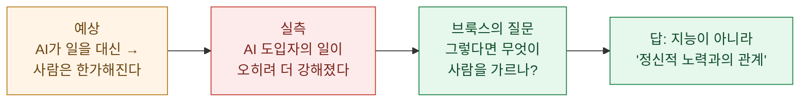

> **한 줄 요약**: AI가 일자리를 빼앗고 사람을 한가하게 만들 거라던 예상과 달리, 초기 도입자들의 일은 **더 강해졌다**. 데이비드 브룩스는 여기서 앞으로 사람을 가를 것은 **얼마나 똑똑한가가 아니라 정신적 노력(mental effort)을 대하는 관계**라고 주장한다.

**데이비드 브룩스(David Brooks)**가 The Atlantic에 쓴 [The People Who Will Thrive in the AI Age](https://www.theatlantic.com/ideas/archive/2026/06/ai-age-mental-effort/)(2026-06-28, 7-06 갱신)를 읽고 정리한 노트다. ⚠️ **유료 기사**라 내가 접근한 건 무료 도입부뿐이다 — 그래서 여기 옮기는 건 **명시된 논지와 인용 연구까지**이고, 본론의 처방은 원문을 봐야 한다. 다만 도입부에 나온 두 연구는 1차 출처로 교차검증했다.

## 반직관적인 출발점

## 근거가 된 두 연구 (팩트체크 완료)

브룩스가 도입부에서 든 두 연구는 실재하고, 인용도 정확하다.

**① ActivTrak — AI를 쓰자 일이 덜해진 게 아니라 강해졌다.** 2026 State of the Workplace 보고서. 4억 4,300만 시간, 1,111개 조직, 16만여 명의 디지털 활동을 분석했고, **10,584명**을 AI 도입 전후 180일로 비교했다.

| 지표 | 변화 |
|---|---|
| 이메일 시간 | **+104%** (브룩스 "두 배 이상"과 일치) |
| 채팅·메시징 | +145% |
| 업무관리 소프트웨어 | **+94%** (브룩스 인용값 그대로) |
| 주말 근무 | +40% 이상 |
| 멀티태스킹 | +12% |
| 집중(방해 없는) 시간 | **하루 -23분 (-9%)** |

**② UC 버클리 Haas — 외주 줬던 일을 다시 떠안는다.** 약 200명 규모 미국 테크사를 8개월 현장 연구. AI가 코딩·엔지니어링을 쉽게 만들자 **PM이 코드를 짜고 리서처가 엔지니어링을 맡는 '업무 잠식(job creep)'**이 벌어졌고, 전문가조차 동료의 AI 산출물을 고치느라 **업무량이 두 배**가 됐다. 하루 중 자연스러운 휴식마저 AI에게 프롬프트를 넣는 시간으로 채워졌다.

두 연구의 결론은 같다 — **AI는 일을 가볍게 하기는커녕 일관되게 강화(intensify)했다.** ActivTrak 초기 도입자의 AI 사용 시간은 8배로 늘었다.

## 브룩스의 명제 — 그래서 무엇이 갈리나

여기까지는 데이터고, 여기서부터는 브룩스의 **해석(오피니언)**이다. 일이 강해진 세계에서 사람을 가르는 건 IQ가 아니라 **정신적 노력을 대하는 태도**라는 것. 노력을 회피 비용으로 보는 사람과, 몰입을 견디고 즐기는 사람 사이가 벌어진다는 프레이밍이다. (구체적 처방은 유료 본론이라 이 노트 범위 밖 — 원문 참조.)

## 🧭 내 볼트 연결

이 진단은 내가 매일 겪는 것과 정확히 겹친다.

- **"하기의 비용"이 0에 가까워지면 병목은 판단·의지로 옮겨간다.** 나도 워크플로로 서브에이전트 여럿을 동시에 돌리다 보면, *할 수 있는 일*이 폭증해서 **일이 줄기는커녕 관리할 것이 늘어난다** — Haas의 "봇 여럿을 감독하는 멀티태스킹"이 남 얘기가 아니다.
- **AI 산출물을 고치는 시간**도 실감한다. fast-model이 숫자를 오독(예: 어떤 지분투자 액수를 $5B→$50B로)하면 결국 사람이 1차 출처로 되짚어야 한다. 생성은 값싸도 **검증은 여전히 사람의 정신적 노력**이다.
- 그래서 이 블로그가 매번 붙이는 **"1차 출처 적대적 팩트체크"** 습관은, 브룩스식으로 말하면 **정신적 노력을 회피하지 않는 쪽에 서겠다는 선택**이다. AI가 일을 강하게 만들수록, 어디에 노력을 쓸지 고르는 힘이 차이를 만든다.

---

*출처: David Brooks, "[The People Who Will Thrive in the AI Age](https://www.theatlantic.com/ideas/archive/2026/06/ai-age-mental-effort/)", The Atlantic (2026-06-28). ⚠️ 유료 기사 — 무료 도입부 기반 요약. 인용 연구는 [ActivTrak 2026 State of the Workplace](https://www.activtrak.com/blog/2026-state-of-the-workplace/)·[UC Berkeley Haas](https://newsroom.haas.berkeley.edu/ai-promised-to-free-up-workers-time-uc-berkeley-haas-researchers-found-the-opposite/)로 교차검증. 명제는 브룩스의 오피니언.*
